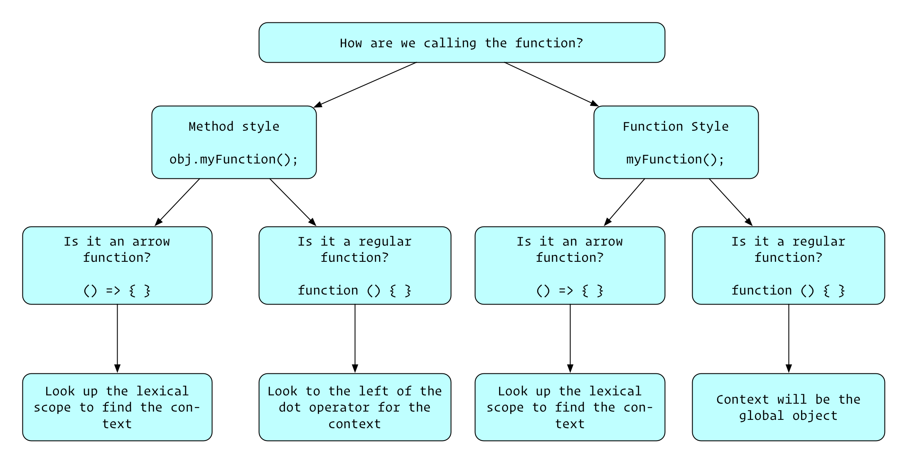

## Scope (W2D4) - Learning Objectives

### Scope
1. Identify the difference between const, let, and var declarations
- `const` does not allow us to reassign the variable. The variable is block-scoped.
- `let` allows us to reassign the variable. The variable is block-scoped.
- `var` allows us to reassign the variable. The variable is function-scoped.

2. Explain the difference between const, let, and var declarations
- There are two main differences between the different variable declarations: their ability to be reassigned and their scope.
- Trying to reassign a `const` will result in an error, whereas reassigning `let` and `var` variables will not. Any variable that should not change value should be created using a `const` so that we can ensure that this expectation is upheld.
- The function-scoped nature of `var` can sometimes cause some issues.
```js
function scopeExample(){
  let letMessage = 'let upper scope';
  var varMessage = 'var upper scope';

  if (true) {
    let letMessage = 'let lower scope';
    var varMessage = 'var lower scope';

    console.log(letMessage); // let lower scope
    console.log(varMessage); // var lower scope
  }

  console.log(letMessage); // let upper scope
  console.log(varMessage); // var lower scope
}
```
- As you can see, the varMessage variable was actually reassigned inside the if block, since `var` is function-scoped. Using the `var` keyword with the same variable name in the same scope does not error out, but instead just reassigns the variable. If we were to do that with `let` (in the same block, since `let` is block-scoped instead of function-scoped), it would throw an error:
```js
if (true) {
  var varTest = "var message!";
  var varTest = "I'm reassigned!";
  let letTest = "let message!";
  let letTest = "nope!"; // Uncaught SyntaxError: Identifier 'test' has already been declared
}
```
- When using `var`, if we happened to use the same name for a variable in our if statement as anywhere else within our function, it would reassign that variable instead of creating a new block-scoped variable. This can cause unintended consequences if we were to rely on that original variable later on in our code.
- In general, using `let` and `const` allows us to have a bit more control over where we can access the variable and prevents unintended reassignment of variables.

3. Predict the evaluation of code that utilizes function scope, block scope, lexical scope, and scope chaining
- Function-scope allows us to repeat variable names in different functions without causing any interaction.
```js
// global scope
let myName = "global";

function function1() {
  // function1's scope
  let myName = "func1";
  console.log("function1 myName: " + myName);
}

function function2() {
  // function2's scope
  let myName = "func2";
  console.log("function2 myName: " + myName);
}

function1(); // function1 myName: func1
function2(); // function2 myName: func2
console.log("global myName: " + myName); // global myName: global
```
- Block-scope provides similar functionality even within a function, separating by any block, such as an `if` statement or `for` loop:
```js
// global scope
let dog = "woof";

// function scope
function bark() {
  let dog = "growl";

  // block scope
  if (true) {
    let dog = "bowwow";
    console.log(dog); // will print "bowwow"
  }

  console.log(dog); // will print "growl"
}

bark();
console.log(dog); // will print "woof"
```
- With scope-chaining, an inner scope has access to variables in the outer scope:
```js
let dog = "Maggie";

function bark() {
  console.log(dog + " says bark!"); // will print "Maggie says bark!"
}
```
- Scope-chaining will look at the closest scope and then work its way outward, so if a variable name is defined in two locations, it will use whichever is in the closest scope:
```js
// global scope
let person = "Rae";

// sayHello function's local scope
function sayHello() {
  let person = "Jeff";

  // greet function's local scope
  function greet() {
    console.log("Hi, " + person + "!");
  }
  greet();
}

sayHello(); // logs 'Hi, Jeff!' because the function-scoped `person` is closer than the global-scoped `person`
```
- Another term that may come up is lexical-scope. Whenever you run a piece of JavaScript that code is first parsed before it is actually run. This is known as the lexing time. In the lexing time your parser resolves variable names to their values when functions are nested. In the example below, during lexing time, the `x` from the console log is evaluated to be `5`. Lexical scope isn't a term that we'll use too often, it really is just referring to the fact that the variables that are in scope at runtime and are evaluated before any code needs to be executed (we know `x` is `5` in the code without having to actually invoke `outer`)
```js
function outer() {
  let x = 5;

  function inner() {
    // here we know the value of x because scope chaining will
    // go into the scope above this one looking for variable named x.
    // We do not need to run this code in order to determine the value of x!
    console.log(x);
  }
  inner();
}
```
- Another aspect related to scope is hoisting. `var` variables will not throw an error if accessed before they are initialized, whereas `let` and `const` variables will. (This is generally seen as a positive, since you most likely wouldn't want your code to be using `undefined` as an intended value. The error from `let` and `const` is much easier to find/debug than potential unintended consequences of utilizing the `undefined` from `var`.)
```js
// Hoisting
// Declaration of var variables are hoisted, meaning they can be referenced before assignment, with their value being undefined
function test() {
  console.log(hoistedVar); // => undefined

  var hoistedVar = 10;
}

// Our compiler knows that our let and const variables exist later on in the code, but it will throw an error so that you know you haven't declared it yet. This is a different error than we would receive if we never declared the variable.
function test() {
  console.log(hoistedLet); // => Uncaught ReferenceError: Cannot access 'hoistedLet' before initialization
  console.log(hoistedConst); // => Uncaught ReferenceError: Cannot access 'hoistedConst' before initialization
  console.log(undeclaredVariable); // => Uncaught ReferenceError: undeclaredVariable is not defined

  let hoistedLet = 10;
  const hoistedConst = 10;
}
```


4. Define an arrow function
- To create an arrow function, we can drop the `function` keyword and use the `=>` syntax between our parameters and curly-braces that open up our function.
```js
// Three different ways to write the same function:
let doubler = (num) => {
  return num * 2;
}

let doubler = function(num){
  return num * 2;
}

function doubler(num){
  return num * 2;
}
```

5. Given an arrow function, deduce the value of `this` without executing the code
- Using an arrow function will maintain the context `this` of wherever it was defined. This can be very beneficial if we don't want the context to change. The context that it maintains may be a little tricky at first. It's important to note that the context is the SAME as the CONTEXT where it was defined, it does not set the context to BE where it was defined. An example to clarify:
```js
const testObj = {
  name: "The original object!",
  createFunc: function() {
    return function() {
      return this.name;
    };
  },

  createNestedArrowFunc: function() {
    // since the context of this top-level function is the testObj, the context within this arrow function is the testObj
    return () => {
      return this.name;
    };
  },

  // since the context of the testObj is global, the context of the arrow function will be global
  topLevelArrowFunc: () => {
    return this.name;
  }
};

const noArrow = testObj.createFunc();
const nestedArrowName = testObj.createNestedArrowFunc();
const topLevelArrowName = testObj.topLevelArrowFunc; // notice for consistency that we are not invoking this function because we want `topLevelArrowName` to be the function that we can invoke. We aren't creating a new function, just pulling out a reference.


noArrow(); // undefined, since the context is global and there is no global `name`
nestedArrowName(); // The original object!, since the context is the testObj
topLevelArrowName(); // undefined, since the context is global and there is no global `name`
```

6. Implement a closure and explain how the closure affects scope
- Because of scope-chaining, a closure has access to any variables that are available within its own scope as well as any outer scope.
- An important (and very useful!) aspect of a closure is that it will keep a reference to all the variables when it was defined, even if the outer function has returned. What this means is that the reference to that variable is not thrown away when the outer function completes execution.
- Look at the counter example below. Whenever we invoke `createCounter` we create a new instance of the `count` variable, starting at `0`. The function that is returned from `createCounter` keeps a reference to this `count` that was made, which is a separate instance of any other time that `createCounter` is invoked. Invoking that returned function (which we stored as `counter`) will increment that `count` that we kept a reference to. Creating a second counter creates a new instance of `count` that can be incremented separately from our original. They live as separate variables that can be incremented independently.
```js
function createCounter() {
  let count = 0;

  return function() {
    count++;
    return count;
  };
}

let counter = createCounter();
console.log(counter()); // => 1
console.log(counter()); // => 2

//we cannot reach the count variable!
counter.count; // undefined
let counter2 = createCounter();
console.log(counter2()); // => 1
```

7. Define a method that references `this` on an object literal
- The keyword `this` can be used to reference the object that a method is being called on.
- In the example below, we make a dog object with attributes for a name string and an isSitting boolean, as well as a stand function. Within the stand function, we are able to affect the isSitting variable by referencing the same object with `this`, then keying in to its isSitting attribute.
```js
let dog = {
  name: "Bowser",

  isSitting: true,

  stand: function () {
    this.isSitting = false;
    return this.isSitting;
  },
};

// Bowser starts out sitting
console.log(dog.isSitting); // prints `true`

// Let's make him stand
console.log(dog.stand()); // prints `false`

// He's actually standing now!
console.log(dog.isSitting); // prints `false`
```

8. Utilize the built in `Function#bind` on a callback to maintain the context of `this`
- In the example below, the dog object does not have a `sayName` function associated with it, it is only created within the cat object.
- We are able to change the context of the function and make the dog object say its name by binding the function to the dog object.
- Using `.bind(context, arg1, arg2, ...)` on a function will change what `this` refers to inside of the function to be whatever we pass in as the context. We can also pass in arguments at bind time as well, which will be passed to the function being bound, but these are optional.
```js
let cat = {
  name: "Meowser",
  sayName: function () {
    console.log(this.name);
  },
};

let dog = {
  name: "Fido",
};

let sayNameFunc = cat.sayName;

let sayHelloCat = sayNameFunc.bind(cat);
sayHelloCat(); // prints Meowser

let sayHelloDog = sayNameFunc.bind(dog);
sayHelloDog(); // prints Fido
```
- An example of providing arguments:
```js
const sum = function (a, b) {
  return a + b;
};

// here we are creating a new function named add3
// this function will bind the value 3 for the first argument.
// We aren't using this inside the function, so we don't really care what the context is.
// We pass in null as the first argument (the context) so that we can give 3 as the first argument to sum by default.
const add3 = sum.bind(null, 3);

// now when we invoke our new add3 function it will add 3 to
// one incoming argument
console.log(add3(10));
```

9. Given a code snippet, identify what `this` refers to

- When a function is invoked method style (invoked directly on an object like `cat.sayName()`), `this` refers to the object that the function was called on:
```js
const cat = {
  name: "Meowser",
  sayName: function () {
    console.log(this.name);
  },
};
```
- If the function is invoked function style (not on an object, but invoked directly like `sayName()`), `this` refers to the scope where the function was defined:
```js
const cat = {
  name: "Meowser",
  sayName: function () {
    console.log(this.name);
  },
};

// We are defining the sayNameFunc in the global scope
const sayNameFunc = cat.sayName;

// `this` will refer to the global object, since that is the scope that sayNameFunc was defined in.
sayNameFunc();
```
- Using an arrow function will maintain the context `this` of wherever it was defined. This can be very beneficial if we don't want the context to change. The context that it maintains may be a little tricky at first. It's important to note that the context is the SAME as the CONTEXT where it was defined, it does not set the context to BE where it was defined. An example to clarify:
```js
const testObj = {
  name: "The original object!",
  createFunc: function() {
    return function() {
      return this.name;
    };
  },

  createNestedArrowFunc: function() {
    // since the context of this top-level function is the testObj, the context within this arrow function is the testObj
    return () => {
      return this.name;
    };
  },

  // since the context of the testObj is global, the context of the arrow function will be global
  topLevelArrowFunc: () => {
    return this.name;
  }
};

const noArrow = testObj.createFunc();
const nestedArrowName = testObj.createNestedArrowFunc();
const topLevelArrowName = testObj.topLevelArrowFunc; // notice for consistency that we are not invoking this function because we want `topLevelArrowName` to be the function that we can invoke. We aren't creating a new function, just pulling out a reference.


noArrow(); // undefined, since the context is global and there is no global `name`
nestedArrowName(); // The original object!, since the context is the testObj
topLevelArrowName(); // undefined, since the context is global and there is no global `name`
```


```js
const dog = {
  name: "Maggie",

  // With an arrow, look where the function itself was defined
  // Since the context of this top-level anonymous function is the dog, the context within this arrow function is the dog itself
  createSayNameFunc: function() {
    return () => {
      return this.name;
    };
  },

  // Since the context of the dog (where the arrow function is defined) is global, the context of the arrow function will be global
  topLevelArrowFunc: () => {
    return this.name;
  }
};
```
