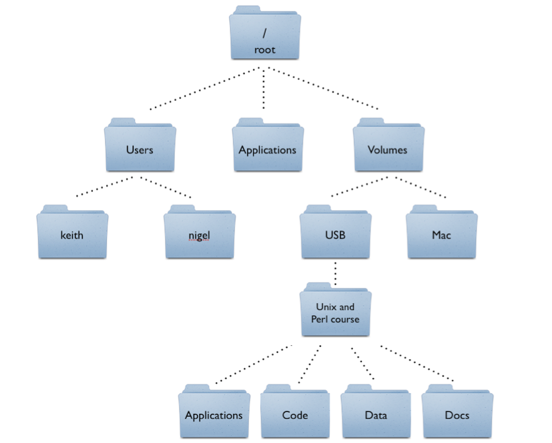
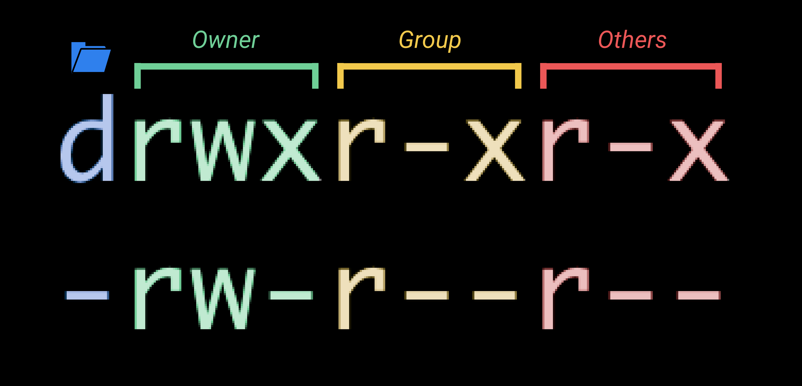

## Command Line Interface (W3D3) - Learning Objectives

### Command Line Interface (CLI) Basics
1. Given a folder structure diagram, a list of `cd (path)` commands and target files, match the paths to the target files.
- This LO was also present last week. Navigation is an essential concept that we need to be comfortable with, especially since we will often use it in combination with the other CLI tools/commands we interact with.
- The "Navigation with cd" quiz from W3D3 is a good example of demonstrating knowledge of this concept.

- For example:
  - To get from `root` to `Applications`, we can use `cd Applications`
  - To get from `root` to `USB`, we can use `cd Volumes/USB`
  - To get from `Mac` to `Applications`, we can use `cd ../../Applications`

2. Create, rename, and move folders using unix command line tools.
- Just like how we can use the `touch` command to create a file, we can use the `mkdir` command to create a folder, providing the name that we would like to give the folder as an argument.
  - `mkdir` will by default make the folder in the current location, but if we provide a full path, we can make a folder in a location that we are not currently at in the terminal.
    - `mkdir test` will make a folder called `test` at our current location
    - `mkdir /test` will make a folder called `test` at the root of our filesystem (assuming we have permission to do so)
  - `mkdir` will also by default only make one layer of folders in a specified path.
    - This means if we say `mkdir AppAcademy/Week3/day3/test`, it will try to navigate from our current location, into `AppAcademy`, into `Week3`, into `day3`, then try to make `test`.
    - If any of those intermediate folders do not exist, our command will fail and we'll see an error that a directory doesn't exist, such as `mkdir: cannot create directory ‘AppAcademy/Week3/day3/test’: No such file or directory`.
    - In order to have `mkdir` make the full chain of folders for us, we can use the `-p` (parent) flag, which will create every missing folder in the path that we specify.
      - `mkdir -p AppAcademy/Week3/day3/test` will create any missing folder instead of causing an error
- We can use the `cp` command to copy files and folders.
  - `cp <source> <destination>` will copy the source file to the destination location.
    - If the destination is a file path (including a file name) it will copy to that new file.
    - If the destination is a directory (just a path of folders, no file specified) it will copy the file to that location and keep the current file name.
    - If a file already exists with the name `cp` is copying to at the destination, it will overwrite the old file with the newly copied one.
  - In order to copy a folder and its contents instead of a single file, we need to provide the `-r` (recursive) flag to the command.
    - `cp -r Week2 newWeek2` will make a copy of Week2 at the current location into a new folder called newWeek2
    - `cp -r Week2 AppAcademy/` will make a copy of Week2 and put it inside of the AppAcademy folder that we have at the same location (notice how we have the `/` at the end to indicate that this is a path to copy to, not a final name to copy the folder as.). We could have accomplished the same thing with `cp -r Week2 AppAcademy/Week2`
- If we want to move a file or folder instead of copying it (think cut/paste instead of copy/paste) we can use the `mv` command.
  - The `mv` command is simply rewriting the path to the file, so unlike the `cp` command, we do not need to specify `-r` for a folder, we can simply provide a source and destination, no matter the object that we are moving.
    - `mv test.txt demos/test.txt` will move a `test.txt` file from our current directory to be inside of the `demos` folder that we have at this level.
    - `mv cli-examples demos/cli-examples` will move a directory called `cli-examples` from our current directory to be inside of the `demos` folder that we have at this same level.
  - Since `mv` is simply rewriting the path, we can also use this functionality to rename a file or folder.
    - `mv tesst.txt test.txt` renames a file originally called `tesst.txt` to `test.txt`
    - `mv super-cool-examples demos` renames a folder `super-cool-examples` to `demos`
    - `mv cool-cli-example-files demos/cli-examples` moves a folder called `cool-cli-example-files` to be nested under the `demos` folder at the current location and renames it to be `cli-examples`
- To completely remove a file or folder we can use the `rm` command.
  - The `rm` can be a dangerous tool! If we delete something in this way, it is removed from the file system completely (unlike the Finder app/Windows Explorer which moves it to the Trash/Recycle Bin).
  - To remove a file, we specify the name or path to the file.
    - `rm test.js` removes the `test.js` file from our current location.
    - `rm demo/test.js` removes the `test.js` file from the `demo` folder that is in our current location.
  - To remove a folder, we add the `-r` (recursive) flag to indicate that we want to remove the folder and all of its contents
    - `rm -r demo` removes the `demo` folder and all of its contents
    - `rm -r W03D3/demo` removes the `demo` folder from the `W03D3` folder that we have at our current location, but it leaves the `W03D3` folder itself. (If we wanted to remove it we would have just specified `rm -r W03D3`)
- There is also a `rmdir` command that we can use specifically for removing a folder, but it will only succeed in removing an empty folder. This is a little bit safer than `rm -r`, since it ensures we are not accidentally deleting content from a folder that we may have needed, but also means it can be less useful/more cumbersome, requiring us to delete each file from the folder individually before deleting the folder itself.

3. Use `grep` and `|` to count matches of a pattern in a sample text file and save result to another file.
- This is a combination of a couple of different commands that we'll explain individually.
- The `grep` command is shorthand for "Globally search for a Regular Expression and Print".
  - The command takes in two arguments, a pattern and a source.
  - The pattern provided to the command is a Regular Expression (regex or regexp for short) that can potentially become a very sophisticated code that will match very specific patterns of characters. We'll get some practice making some more sophisticated patterns to match in the future using regex, but the simplest pattern that we can provide is a basic string. Providing a regular string as an argument will search for that phrase inside of our source.
  - The source that we provide is a file or path to a file that we want to be searching.
  - `grep "apple" projects/fruit-stand.js` will search the `fruit-stand.js` file, nested under our `projects` folder for any instance of the string `apple`.
  - `grep` by default will output each instance of the full line that contains a matching pattern.
  - To change the output to instead be the count of matches instea of the matches themselves, we can use the `-c` flag.
    - `grep -c "apple" projects/fruit-stand.js` will now print out the number of times that "apple" is found instead of the line that apple was found in.
- The `|` operator will take the output of the first command and supply it as an argument to the second command. In order save output to a file as well as see it in the terminal, we can use the `tee` command to indicate the file we would like the output saved to.
  - Overall our command could look something like `grep -c "apple" projects/fruit-stand.js | tee apple-count.txt`, which counts the occurances of "apple" in the nested `fruit-stand.js` file, prints the result to the console, and saves it to a file in our current directory called apple-count.txt.
- Instead of using `|` and `tee` we could also use the redirection operators `>` or `>>`.
  - The redirection operators work very similarly to `| tee` in that they take the output of one command and save them to the destination provided after the operator.
  - The output will not be printed to the terminal with this approach, but it will be saved to the file.
  - The difference between `>` and `>>` is the single operator `>` will create or overwrite a file with the output while the double `>>` will append to the file if it already exists instead of overwriting.
  - The overall command could look something like `grep -c "apple" projects/fruit-stand.js > apple-count.txt`

4. Find what `-c`, `-r`, and `-b` flags do in `grep` by reading the manual.
- We can access the manual directly in the terminal of many of these terminal commands.
- `man <command>` will bring up the manual for the command (the documentation for what the command does, arguments, flags that can be provided, etc.)
- `man grep` will bring up the full manual, which we can read to find the necessary information.
- We can also search the grep manual using grep! We'll get some help from the `|` operator and the `-C` context flag for `grep`. (It's important to note that flags are case-sensitive, so the `-C` flag is different from the `-c` flag.)
  - `man grep | grep -C1 "\-c,"`
    - `man grep` is pulling in the manual for the grep command
    - `|` is taking that output and supplying it as an argument to the command that follows (the source for our grep command)
    - `grep -C1` is searching using the `-C` context flag. This flag provides additional output above and below just the line that the pattern was matched. the `1` indicates that we want one line above the matching pattern and one line below.
    - `"\-c,"` is indicating the pattern that we want to match. We are using a `\` in our string to escape the `-` so that the terminal does not think we are providing another flag, it's actually part of the string that we are searching for. Another way we could have gone about this is to use `--` to indicate that we are done providing options and are now only providing the arguments to the command: `man grep | grep -C1 -- "-c,"`

5. Identify the difference in two different files using `diff`.
- Similar to the `git diff` command that we learned previously to compare two different commits, we can compare two files in our filesystem by using `diff file1 file2`
- The output will look something like this:
```
38c38
<   - 03b-array-method-clones
---
>   - 03b-array-method-clonesdsfgd
45d44
<   - 04a-arrow-functions
48a48
>   - other
```
- Before each difference we are given the line number in the first file, whether it was a change (c), deletion (d), or addition (a), and the line number that it corresponds to in the second file.
- After the line number and difference type indication, we are shown the actual line(s). `<` indicates it is the line from the first file and `>` indicates it is the line from the second file.

6. Open and close nano with and without saving a file.
- To open nano, we provide the file or path to the file that we would like to open up, such as `nano ~/.bashrc`, which will open our `.bashrc` file from our user's home directory (`~` shortcut).
- After opening a file, its contents are displayed in the in-terminal editor. Along the bottom we can also see indicators for keyboard commands such as Exit, Replace, Write Out (save), etc. To exit, use `ctrl x`. If you made any changes, it'll prompt to see if you'd like to save.
- If we want to open a new, empty buffer to type into (and potentially save as a new file), we can simply use the command `nano` without supplying a file name/path to open.

7. Use `curl` to download a file.
- The `curl` command will output the result of the url provided as an argument.
- By default it will print it to the console, but we can save it to a file using the `-o` (output) flag with a file name or path.
- `curl example.com` will print the html to the terminal
- `curl -o example.html example.com` will save the html to a file called `example.html`

8. Read the variables of `$PATH`.
- `$PATH` is a variable that is available system-wide and utilized by many other applications.
- It stores a reference to all of the directories where you might store applications in. Each directory is the full path separated by `:`.
- When a command is run, the shell starts at the beginning of this PATH variable and checks each directory to see if that location has that name as an available application to run.
- Once it finds a match, it passes along any variables provided to the command from the input and stops searching. This means that paths listed at the beginning of the PATH variable will be used first, so if multiple locations have a reference to an application/command by the same name, the first one listed will be used.

9. Explain the difference between `.bash_profile` and `.bashrc`.
- The main difference between these files is when they are run.
- `.bash_profile` is run whenever a login shell is opened while `.bashrc` is run for every non-login shell. 
- To complicate things slightly, there is another file `.profile` that functions the same as `.bash_profile` but is the standard for Ubuntu. It is run in the same instances (a login shell) that the `.bash_profile` would run because by default `.bash_profile` doesn't exist on this platform. If we were to make one, however, the `.bash_profile` would take precedence and be run instead of `.profile`
- When we log in to an operating system, the login shell is run, meaning the `.bash_profile` or `.profile` is executed when starting up our machine. 
- Different operating systems also open the terminal differently and will therefore run these files differently:
  - macOS runs Bash as a login shell every time you open the Terminal application, meaning it will always run `.bash_profile` when a new terminal is opened up.
  - WSL on Windows opens every Bash as a login shell as well, meaning it runs `.profile` (standard from Ubuntu)
  - Ubuntu opens the terminal and runs Bash as a non-login shell, meaning it only runs `.bashrc` for each new terminal window, leaving `.profile` (or `.bash_profile` if we made one ourselves) to only be run when logging in.
- In general, any action that should be performed every time we open a terminal, such as printing the current time or creating an alias (so that other apps could also use them), we should probably put that command in the `.bashrc` file.
- Any action that only really needs to be done once (upon login), such as setting up our system's PATH variable, creating a daily message, or checking for software updates, should probably be put in the `.bash_profile` file.
- Understanding when these files are sourced can be helpful in figuring out why your customizations may not be being implemented within your system. These default behaviours are important to understand whenever you are working with a different machine or setting up a new environment. With that in mind, these are some recommendations for setting up your own machine to provide for a consistent experience based on your OS:
  - macOS Catalina with Zsh
    - Put your customizations into your .zshrc file.
    - Change Visual Studio Code to use zsh as it's shell. (In VSCode, cmd+shift+P to search commands -> "Preferences: Open Settings (JSON)" -> add the following keys to the object at the top level: `"terminal.integrated.shell.osx": "zsh", "terminal.integrated.shellArgs.osx": [ "-l" ]`)
  - macOS pre-Catalina with Bash
    - Put your customizations into your .bash_profile file.
  - Ubuntu Linux
    - Change your terminal to open login shells (in the terminal, Edit -> Preferences -> Command -> "Run command as a login shell")
    - Put your customization into your .profile file.
    - Change Visual Studio Code's integrated terminal to launch login shells as well. (In VSCode, ctrl+shift+P to search commands -> "Preferences: Open Settings (JSON)" -> add the following keys to the object at the top level: `"terminal.integrated.shell.linux": "bash", "terminal.integrated.shellArgs.linux": [ "-l" ]`)
  - Windows with WSL
    - Put your customization into your .profile file.
    - Change Visual Studio Code's integrated terminal to launch login shells as well. (Same steps as Ubuntu above)

10. Create a new alias by editing the `.bash_profile`.
- We can create an alias in our dotfiles by using the `alias <shortcut>='<original command>'`
- `alias rm='rm -i'` will make it so that every time you run `rm`, it will actually be running `rm -i`, an interactive command that will confirm the file/directory you are deleting.

11. Given a list of common scenarios, identify when it is appropriate and safe to use `sudo`, and when it is a dangerous mistake.
- `sudo` stands for 'Super User Do', which allows you to impersonate the `root` user of your machine in order to execute a command.
- In most cases, permission are in place to prevent you from accidentally messing up your system.
- A common place where `sudo` may be needed is for installing applications. Applications often need access to system information or need to be able to modify data that is originally only accessible by the `root` user. Adding `sudo` to an application installation may be necessary to grant those permission to the application going forward.
- A common place where `sudo` should almost always NOT be used is with the `rm` command. Removing files that are protected by the root user can often lead to permanent damage of the operating system, deleting important system data.

12. Write a shell script that greets a user by their `$USER` name using `echo`.
- Our script file starts with the shebang to indicate how the script should be interpreted. Here we are saying to execute the code with bash.
- Next we have a comment to describe what our script is intended to do.
- Finally we have the body of the script, which is using `echo` to print to the terminal as well as evaluating the logged in user's username using the `$USER` variable.
```sh
#!/bin/bash

# "Hello, $USER!" by Bryce Morgan
#
# Greets the current user in the terminal

echo "Hello, $USER!"
```
- In order to make this script executable, we have to change the permissions (next LO!)

13. Use `chmod` to make a shell script executable.
- `chmod` (change mode) is a command that we can use to change the permissions of files and directories.
- To view the permissions of files and directories in our current location, we can use the `ls -al` command.
  - The first column printed for each entry are ten characters that represent the permissions for that file or directory.
  - The first character is just a flag to indicate whether the item is a directory (d) or a file (-).
  - The following nine characters are organized into three groups of three.
    - The groups represent the owner/user (u), the group (g), and others/everyone else (o).
    - Each group then has three characters which are flags representing if that person can read the item (r or -), write/modify the item (w or -), and execute the item (x or -).
    
- We can use two different formats for changing permissions: letters or numbers.
  - To use letters, we specify who we want to change the permission for (u, g, and or o), if we are adding or removing a permission (+ or -), and what permission we are altering (r, w, or x). If we don't specify who we are changing the permissions for, it is applied to all three user categories.
    - `chmod ug+x hello-user.sh` adds the permission to execute the file to the user and group.
    - `chmod -wx hello-user.sh` removes the write and execute permission from all three user categories.
  - To use numbers, calculate the permission code that we want to apply to the file or directory.
    - A read permission is represented by 4, a write permission is 2, and an execute permission is 1. This is done so that any combination of permissions is a unique number between 0 and 7.
    - The sum of permissions are then used to create a three digit value for the user, group, and other categories concatenated together.
    - `chmod 600 hello-user.sh` applies permissions of `-rw-------`, meaning the user can read and write, but no other permissions are available.
    - `chmod 764 hello-user.sh` applies permissions of `-rwxrw-r--`, meaning the user can read, write, and execute, the group can read and write, and others can only read the file.
- To make our `hello-user.sh` script executable by anyone, we can use the command `chmod +x hello-user.sh`.
