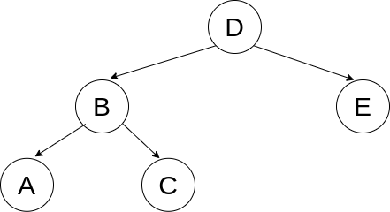

## Binary Trees (W8D2) - Learning Objectives

### Binary Trees
1. Explain and implement a Binary Tree.
  - A tree is a collection of nodes and edges between them.
  - It cannot have any cycles, which are edges that form a loop between nodes.
  - We also only consider rooted trees in computer science, which is a tree that has one root node that is able to access all other nodes.
  - For a tree to be a binary tree, each node can have a maximum of two children.
  - It's important to be able to identify and explain tree terminology as well. If given a tree, be able to point out each component.
    - root: The single node of a tree that can access every other node through edges.
    - parent node: A node that is connected to lower nodes in the tree. If a tree only has one node, it is not a parent node because there are no children.
    - child node: A node that is connected to a higher node in the tree. Every node except for the root is a child node of some parent.
    - sibling nodes: Nodes that have the same parent.
    - leaf node: A node that has no children (at the ends of the branches of the tree)
    - internal node: A non-leaf node (aka a parent)
    - path: A series of nodes that can be traveled through edges.
    - subtree: A smaller portion of the original tree. Any node that is not the root node is itself the root of a subtree.
  - Know the basics of each term
    - A non-empty tree has to have a root.
    - A tree doesn't have any parent nodes if there are no children.
    - What's the min/max number of parent and leaf nodes for a tree with 5 nodes?
      - Two extreme implementations:
      
      - Implementing in a chain results in max number of parents and min number of leaves: 4 parents, 1 leaf
      
      - Implementing as a balanced tree results in min number of parents and max number of leaves: 2 parents, 3 leaves
  - All that we need in order to implement a binary tree is a TreeNode class that can store a value and references to a left and right child. We can create a tree by assigning the left and right properties to point to other TreeNode instances:
  ```javascript
  class TreeNode {
    constructor(val) {
      this.val = val;
      this.left = null;
      this.right = null;
    }
  }
  ```

2. Identify the three types of tree traversals: pre-order, in-order, and post-order.
  - Pre-order: Values are accessed as soon as the node is reached.
  - In-order: Values are accessed after we have fully explored the left but before we explore the right branch.
  - Post-order: Values are accessed after all of our children have been accessed.
  - *Breadth First: The previous three are types of Depth First Traversals. Breadth first accesses values of nodes by level, left to right, top to bottom.
  - Given a tree, be able to determine the order of each traversal type:
    
    - Breadth First: 20, 9, 24, 7, 11, 23, 27, 3, 10, 17, 36, 30
    - Pre-order: 20, 9, 7, 3, 11, 10, 17, 24, 23, 27, 36, 30
    - In-order: 3, 7, 9, 10, 11, 17, 20, 23, 24, 27, 30, 36
    - Post-order: 3, 7, 10, 17, 11, 9, 23, 30, 36, 27, 24, 20

3. Explain and implement a Binary Search Tree.
  - A binary search tree is a binary tree with the added stipulation that all values to the left of a node are less than its value and all values to the right are greater than its value.
  - Example of a BST with an insert method. You won't be asked to implement a removal:
  ```javascript
  class BST {
    constructor() {
        this.root = null;
    }

    insert(val, currentNode=this.root) {
      if(!this.root) {
        this.root = new TreeNode(val);
        return;
      }

      if (val < currentNode.val) {
        if (!currentNode.left) {
          currentNode.left = new TreeNode(val);
        } else {
          this.insert(val, currentNode.left);
        }
      } else {
        if (!currentNode.right) {
          currentNode.right = new TreeNode(val);
        } else {
          this.insert(val, currentNode.right);
        }
      }
    }
  }
  ```
  