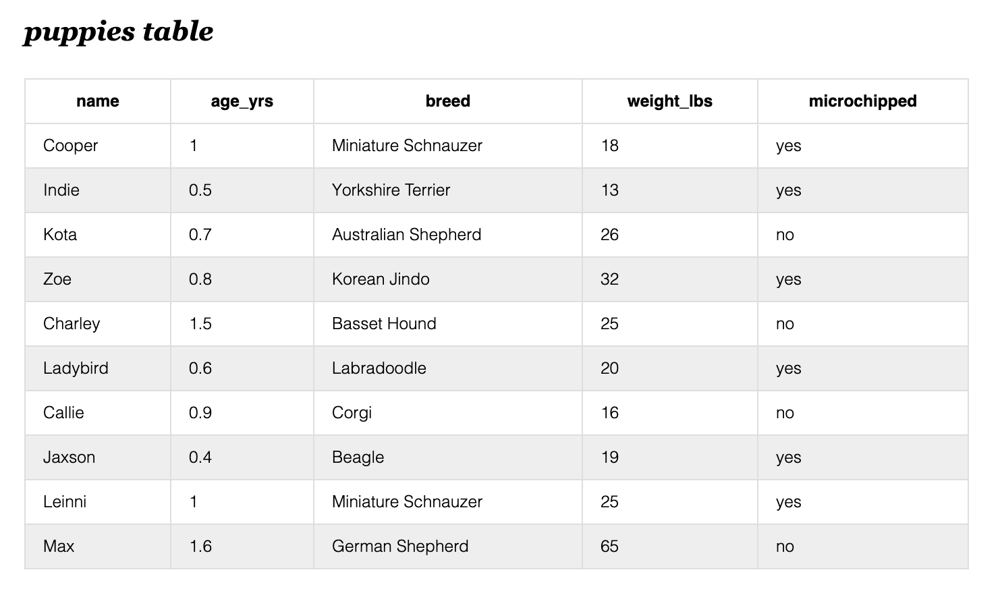
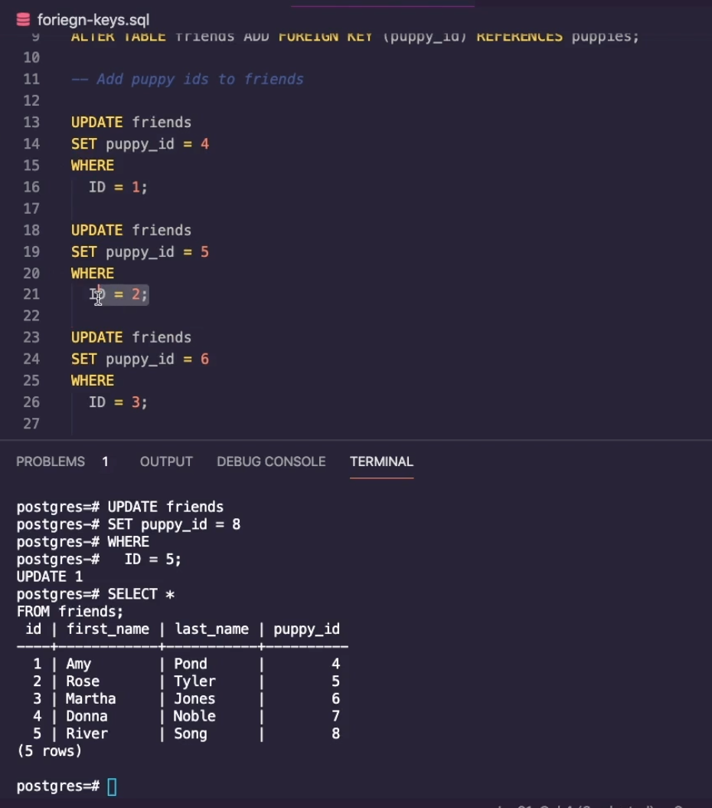

# W10D2
- INSERT 
- UPDATE 
- DELETE 
- Writing simple queries using SELECT 
- JOINING TABLES 

---
## `INSERT`  
- Lets talk about `primary key` and `foreign keys`
    - primary key =>  the id of the row
    - foreign key =>  a column in a table that points to anohter row's primary id 

- 

- Running the following code would `insert` those puppy items into our database, specifically `into` the table named `puppies`:

- Note the syntax: 

```sql
    INSERT into puppies
    values
    ('Cooper', 1, 'Miniature Schnauzer', 18, 'yes');

    INSERT into puppies
    values
    ('Indie', 0.5, 'Yorkshire Terrier', 13, 'yes'),
    ('Kota', 0.7, 'Australian Shepherd', 26, 'no'),
    ('Zoe', 0.8, 'Korean Jindo', 32, 'yes'),
    ('Charley', 1.5, 'Basset Hound', 25, 'no'),
    ('Ladybird', 0.6, 'Labradoodle', 20, 'yes'),
    ('Callie', 0.9, 'Corgi', 16, 'no'),
    ('Jaxson', 0.4, 'Beagle', 19, 'yes'),
    ('Leinni', 1, 'Miniature Schnauzer', 25, 'yes' ),
    ('Max', 1.6, 'German Shepherd', 65, 'no');
```


---

## `UPDATE`
 - Update allows you to edit existing data entries in your database. 
 - The example below shows three `update` statements:   
    - 1. Update the row in the friends table that has an `ID = 1` to now have its `puppy_id = 4` equal to 4.
    - 1. Repeat the above for a few more friends. 

- Syntax:

```sql
            UPDATE tablename
            SET column_name = x
            WHERE 
                column_name = y
```

---

## `DELETE`

```sql
DELETE FROM friends
WHERE id = 5
```

---

## `SELECT` 
- This clause is for picking specific columns or '*' i.e. everything from a databse. 

---
## Adding a foreign key reference

- You have two existing tables, `friends` and `puppies`. You want to add a reference
in your friends table to point to the puppy they own. How do we retroactively do so?

    1. add the foreign key
    2. update a record to now have a `puppy_id` value
    3. select all records from both tables, where the tables have the following criteria `puppies.id = friends.puppy_id`

* Note the syntax for adding a foreign key.

```sql 
    ALTER TABLE friends ADD 
    FOREIGN KEY (puppy_id) REFERENCES puppies (id); 


    UPDATE friends 
    SET puppy_id = 4
    WHERE id = 1;

    SELECT *
    FROM 
    puppies INNER JOIN friends ON puppies.id = friends.puppy_id
```

- Using update to populate the new `puppy_id` column: 



## JOIN 
- There are many types of joins => Inner, left outer, etc. 
- You should understand Inner join. 
- In psql `JOIN` keyword defaults to an `INNER JOIN`. 


