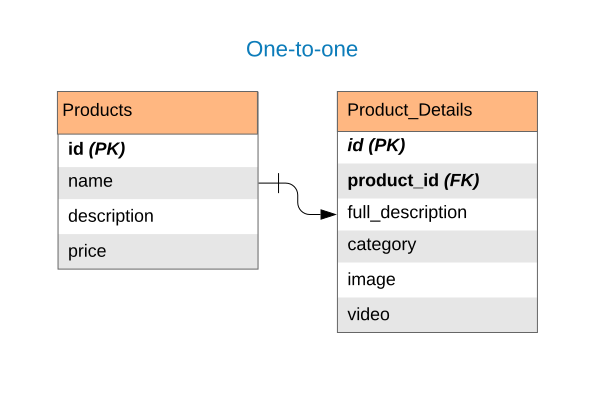
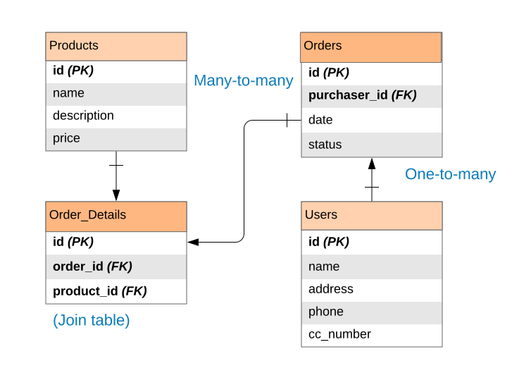

## SQL (continued) (W10D3) - Learning Objectives

### SQL (continued)
1. How to perform relational database design
- Steps to Designing the Database:
  - Define the entities. What data are are you storing, what are the fields for each entity?
    - You can think of this in similar ways to OOP (object oriented programming).
    - If you wanted to model this information using classes, what classes would you make? Those are generally going to be the tables that are created in your database.
    - The attributes of your classes are generally going to be the fields/columns that we need for each table.
  - Identify primary keys. Most of the time these will be ids that you can generate as a serial field, incrementing with each addition to the database.
  - Establish table relationships. Connect related data together with foreign keys. Know how we store these keys in a one-to-one, one-to-many, or many-to-many relationship.
    - With a one-to-one or one-to-many relationship, we are able to use a foreign key on the table to indicate the other specific record that it is connected to.
    - With a many-to-many relationship, each record could be connected to multiple records, so we have to create a join table to connect these entities. A record on this join table connects a record from one table to a record from another table.
  
  

2. How to use transactions to group multiple SQL commands into one succeed or fail operation
- We can define an explicit transaction using `BEGIN` and ending with either `COMMIT` or `ROLLBACK`.
- If any command inside the block fails, everything will be rolled back. We can also specify that we want to roll back at the end of the block instead of committing. We saw that this can be useful when analyzing operations that would manipulate our database.
```sql
BEGIN;
  UPDATE accounts SET balance = balance - 100.00
      WHERE name = 'Alice';
  UPDATE branches SET balance = balance - 100.00
      WHERE name = (SELECT branch_name FROM accounts WHERE name = 'Alice');
  UPDATE accounts SET balance = balance + 100.00
      WHERE name = 'Bob';
  UPDATE branches SET balance = balance + 100.00
      WHERE name = (SELECT branch_name FROM accounts WHERE name = 'Bob');
COMMIT;
```
```sql
BEGIN;
  EXPLAIN ANALYZE
  UPDATE cities
  SET city = 'New York City'
  WHERE city = 'New York';
ROLLBACK;
```

3. How to apply indexes to tables to improve performance
- An index can help optimize queries that we have to run regularly. If we are constantly looking up records in a table by a particular field (such as username or phone number), we can add an index in order to speed up this process.
- An index maintains a sorted version of the field with a reference to the record that it points to in the table (via primary key). If we want to find a record based on a field that we have an index for, we can look through this index in a more efficient manner than having to scan through the entire table (generally O(log n) since the index is sorted, instead of O(n) for a sequential scan).
- To add an index to a field we can use the following syntax:
```sql
CREATE INDEX index_name ON table_name (column_name);
```
- To drop an index we can do the following:
```sql
DROP INDEX index_name
```
- Making an index is not always the best approach. Indices allow for faster lookup, but slow down record insertion and the updating of associated fields, since we not only have to add the information to the table, but also manipulate the index.
  - We generally wouldn't care about adding an index if:
    - The tables are small
    - We are updating the table frequently, especially the associated columns
    - The column has many NULL values

4. Explain what and why someone would use EXPLAIN
- EXPLAIN gives us information about how a query will run (the query plan)
- It gives us an idea of how our database will search for data as well as a qualitative comparitor for how expensive that operation will be. Comparing the cost of two queries will tell us which one is more efficient (lower cost).
- We can also use the ANALYZE command with EXPLAIN, which will actually run the specified query. Doing so gives us more detailed information, such as the milliseconds it took our query to execute as well as specifics like the exact number of rows filtered and returned.

5. Demonstrate how to install and use the node-postgres library and its Pool class to query a PostgreSQL-managed database
- We can add the `node-postgres` library to our application with `npm install pg`. From there we will typically use the Pool class associated with this library. That way we can run many SQL queries with one database connection (as opposed to Client, which closes the connection after a query).
```javascript
const { Pool } = require('pg');

// If we need to specify a username, password, or database, we can do so when we create a Pool instance, otherwise the default values for logging in to psql are used:
const pool = new Pool({ username: '<<username>>', password: '<<password>>', database: '<<database>>'})
```
- The `query` method on the Pool instance will allow us to execute a SQL query on our database. We can pass in a string that represents the query we want to run
```javascript
const allAirportsSql = `
  SELECT id, city_id, faa_id, name
  FROM airports;
`;

async function selectAllAirports() {
  const results = await pool.query(allAirportsSql);
  console.log(results.rows);
  pool.end(); // invoking end() will close our connection to the database
}

selectAllAirports();
```
- The return value of this asynchronous function is an object with a `rows` key that points to an array of objects, each object representing a record with field names as keys.

6. Explain how to write prepared statements with placeholders for parameters of the form "$1", "$2", and so on
- The prepared statement (SQL string that we wrote) can also be made more dynamic by allowing for parameters to be passed in.
- The Pool instance's `query` function allows us to pass a second argument, an array of parameters to be used in the query string. The location of the parameter substitutions are designated with `$1`, `$2`, etc., to signify the first, second, etc., arguments.
```javascript
const airportsByNameSql = `
  SELECT name, faa_id
  FROM airports
  WHERE UPPER(name) LIKE UPPER($1)
`;

async function selectAirportsByName(name) {
	const results = await pool.query(airportsByNameSql, [ `%${name}%` ]);
	console.log(results.rows);
	pool.end(); // invoking end() will close our connection to the database
}

// Get the airport name from the command line and store it
// in the variable "name". Pass that value to the
// selectAirportsByName function.
const name = process.argv[2];
// console.log(name);
selectAirportsByName(name);
```
