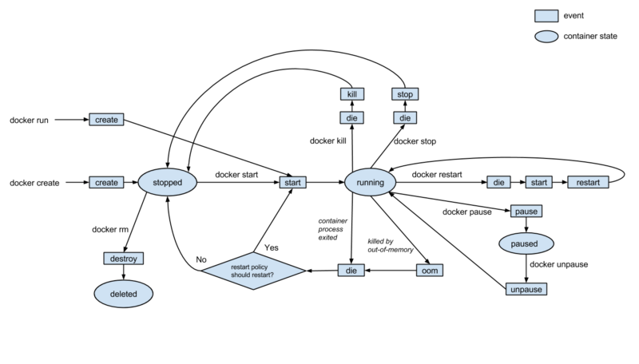

## Docker Containers (W19D2) - Learning Objectives
1. Recognize that Docker is an open-source project used to create, deploy, and run application with containers

2. Differentiate between virtual machines and containers
- A virtual machine contains a complete operating system and applications, which is generally more resources than any individual application needs. The kernal takes time to boot up and resources such as RAM and disk space are allocated ahead of time, which will not be released until the VM is taken down.
- Containers do not have a hypervisor, relying instead on the host machine's kernal. They are faster to boot up and more lightweight than a VM.

3. Differentiate between the two main types of hypervisors that enable virtualization: bare metal and hosted
- Bare metal hypervisors have their own device drivers which interact directly with hardware
- Hosted hypervisors act as translators. They are installed on a host OS, then translate commands from the guest operating system into calls that the host OS would make.

4. Recall that containers are used to run processes in isolated environments
- In general we can create a container that has one main task, such as a database or backend server, then connect them together on a network.

5. Summarize that a container is a unit of software that packages code and dependencies so an application can run quickly and reliably between different environments
- A container is an instance of an image. We can think of an image as a template and a container is our instance of that template. (Like a class and instance in OOP)

6. Explain the lifecycle of a docker container
- Containers are ephemeral. We can stop and destroy them very quickly, and when we do, all data created during its existence is wiped out by default.
- We can also very quickly rebuild a container and have it up and running.
- Afer creation, the container is generally started and running until a command is issued to stop, restart, or pause its execution, when it will then enter the appropriate state.
- The diagram below may look intimidating at first, but if we trace it through there are just a few commands that tell the container to enter a new state:


7. Summarize what a Docker image is
- An image is a file that contains the code, system tools, libraries and dependencies that an app needs to run.
- An image can be built off of other images, building up layers with these changes that other images can be built on.
- Each image is read-only. In order to make changes to an existing image we create a new layer with these changes added on top.
- An image is like a template. We cannot execute it directly, but we can create and run a container that is an instance of it.

8. Explain how to start a container and the various flags that we may use with the command
- The command `docker container run {image-name}` will start up a container based on the specified image
- Common flags to include with this command are `-d`, `--net {network name}`, `-p {local port}:{image's port}`, and `--name {container name}`
  - `-d`: run the container in detached mode, running in the background
  - `--net {network name}`: adds the container to the specified network
  - `-p {local port}:{image's port}`: such as `-p 8080:80`, exposes the local port and forwards all traffic to the image's port. This would allow us to navigate to localhost:8080, sending our request to the image's port 80, for example. The port that we want to send traffic to will generally line up with the port indicated in the `EXPOSE` line of the Dockerfile
  - `--name {container name}`: such as `--name web` allows us to name a container. Docker will generate a random name for us, but by specifying, it is easier to determine what a container does and it also allows us to use this name when referencing other containers on our network (through DNS)
- All together an example command may be `docker container run -d --net mybridge -p 8080:80 --name web nginx`

9. Explain what happens when a container is started; what is the process for getting and starting an instance of the image?
- Docker checks to see if the image we are trying to create a container for exists locally.
- If not found locally, it will download the image from the remote repository (defaults to the `latest` version, hosted on Docker Hub)
- A container is created based on the image
- The container is given a virtual IP on the network specified (or default bridge network)
- The port from `-p` is opened and forwarded to the specified internal port of the container (if the flag is given, otherwise no ports are opened)
- The container is started using the `CMD` specified int he Dockerfile

10. Differentiate between how volumes and bind mounts store persistent data for containers.
- Volumes are stored on the host filesystem in a location managed by Docker. They are generally not touched by anything other than Docker.
- The container is given access to the volume and can interact with the data. When the container is removed, the volume persists.
- Bind mounts are not restricted to being managed by Docker. A bind mount can be created anywhere on the host system.
- Since they are not managed by Docker, any other application that has access to its location can interact with the bind mount, such as modifying its contents directly within VSCode or nano.
- Bind mounts can also be a little more difficult to work with since they cannot be included in a Dockerfile, requiring the mount to be specified when a container is run.
- Since a bind mount is pointing to a location on the host directly, it also means that the app running in the container can modify the host system, which may be a security concern.

11. Execute the `docker volume` command to store data and connect to none, one, or multiple containers at once
- To create a volume, we can use `docker volume create {volume-name}` command to create a volume directly
- We can attach a volume to a container using the `-v {volume-name}:{mount-point}:{options}` flag on container run
  - `volume-name`: Optional, can be used to specify a name for the volume instead of creating an id for it. Also used for specifying a volume that already exists.
  - `mount-point`: Required, where the volume will be accessible within the container
  - `options`: Optional, provides additional options, such as read-only (`ro`), etc.
- An example for starting a container with an attached volume:
  - `docker container run -d --name web -v myvol:/app nginx`

12. Implement the default `bridge` driver to define your own bridge network when running multiple containers
- There are many benefits to creating a user-defined bridge network for your containers, including isolation from outside traffic, automatic DNS resolution, and shared environment variables.
- To create a network, we can use `docker network create --driver bridge {network-name}` (bridge is also the default driver)
- To add a container to our custom network, we add the `--net {network-name}` flag to our run command:
```bash
docker network create --driver bridge mybridge
docker container run -d --net mybridge --name db redis
docker container run -d --net mybridge -e DB=db -p 8000:5000 --name web chrch/web
```
- All outside traffic to localhost:8000 will be forwarded to the `web` container's port 5000. Even though the `db` container is not exposed to the outside, the `web` container can still talk to it since it is on the same network.


11. Recognize other Docker network drivers (`overlay`, `host`, `macvlan`, and `none`)
- These drivers are less common, especially for day-to-day interaction, but being familiar with them is good knowledge to have:
  - overlay: Enables Docker Swarm services to communicate with each other
  - host: For standalone containers using Docker Swarm; removes network isolation and uses the host's networking directly
  - macvlan: Allows you to assign a MAC address to a container, making it appear as a physical device on the network
  - none: Disable all networking

12. Execute a health check on a container with the `docker container run ...` command, a Dockerfile, or Docker Compose
- `docker container run ...`
  - When we start up a container, we can specify a health check by using the `--health-cmd="{command-to-run}"` flag.
    - `{command-to-run}` should be a command that could potentially cause an `exit 1` (failure) or returning of `false`. Anything else would be considered a healthy check.
  - Similar to the Dockerfile and compose, we can also specify options with `--health-interval`, `--health-retries`, `--health-timeout`, or `--health-start-period`
  - For example, the following would start a postgres container with a health check to make sure we can communicate with the postgres service:
    - `docker container run --name p2 -d --health-cmd="pg_isready -U postgres || exit 1" postgres`
- Dockerfile
  - In a Dockerfile, we can include the `HEALTHCHECK` instruction which accepts options followed by the command to run:
    - `HEALTHCHECK [OPTIONS] CMD {command}`
    - Possible options are setting an interval (`--interval=DURATION`, default 30s), a timeout (`--timeout=DURATION`, default 30s), a start period (`--start-period=DURATION`, default 0s), and a number of retries (`--retries=N`, default 3)
  - For example, the following would set a timeout of 10s for each attempt at hitting port 3000:
    - `HEALTHCHECK --timeout=10s CMD curl --fail http://localhost:3000/ || exit 1`
- Docker Compose
  - In a compose file, we can indicate a `healthcheck` key, indicating our command as the `test` key
  - We can still indicate our options with an `interval`, `timeout`, `retries`, or `start_period` key
  - For example, the following will start up an nginx container with a healthcheck for curling localhost:
  ```yaml
  version: "3.4" 
  services:
      web:
      image: nginx
      healthcheck:
          test: ["CMD", "curl", "-f", "http://localhost"]
          interval: 1m30s
          timeout: 10s
          retries: 3
          start_period: 1m  # minimum version 3.4 of DockerCompose
  ```

13. Interpret the meaning of the three health statuses: `starting`, `healthy`, and `unhealthy`
- `starting`: The container is currently booting up, health checks have not yet been run (up to a 30 second process)
- `healthy`: Health checks are running at the specified intervals
- `unhealthy`: The number of specified consecutive failures has been reached


14. Execute the `docker container ls` command to view health checks
- The command `docker container ls` shows all of our running containers
- When a healthcheck is associated with a container, the STATUS column of the output will indicate the health check status
```bash
$ docker container ls  
CONTAINER ID        IMAGE               COMMAND                  CREATED             STATUS                   PORTS               NAMES
d68125e29c04        postgres            "docker-entrypoint.s…"   4 minutes ago       Up 4 minutes (healthy)   5432/tcp            p2
```
