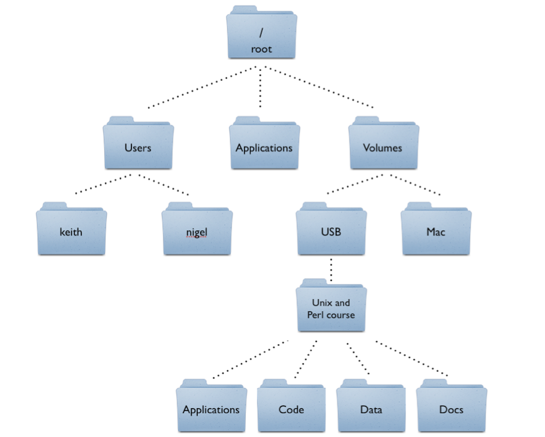

# Intermediate JavaScript (Week 2) - Learning Objectives

## Assessment Structure
- 2 hours
- Mixture multiple choice (10-15), free response (1-2), coding in an online REPL (3-4), and coding problems completed in VSCode and uploaded (10-15).
  - Coding problems will have specs to run (`mocha`) and check your work against
- Standard assesment procedures
  - You will be in an individual breakout room
  - Use a single monitor and share your screen
  - Only have open those resources needed to complete the assessment:
    - Zoom
    - VSCode
    - Browser with AAO and Progress Tracker (to ask questions)
    - Approved Resources for this assessment:
      - MDN Docs: https://developer.mozilla.org/en-US/docs/Web/JavaScript


## Running JS Locally (W2D1) - Learning Objectives

### Running JS Locally
1. Match the commands ls, cd, pwd to their descriptions
- `ls` lists all of the files and directories in the current location
- `cd` changes directory. We can provide a single directory to move into that's at our current location, or a full path to move to. We can also use `..` to indicate to move up one directory.
- `pwd` shows the present working directory, ie where we currently are in our computer's file system.

2. Given a folder structure diagram, a list of 'cd (path)' commands and target files, match the paths to the target files.
- The "Match the Path" quiz is a great example of knowledge that you should have for navigation.

- For example:
  - To get from `root` to `Applications`, we can use `cd Applications`
  - To get from `root` to `USB`, we can use `cd Volumes/USB`
  - To get from `Mac` to `Applications`, we can use `cd ../../Applications`

3. Use VSCode to create a folder. Within the folder create a .js file containing `console.log('hello new world');` and save it.
- Be able to use the GUI to create folders and files.
- The terminal is often more efficient than a GUI.
  - `mkdir` will make a new directory at the current location: `mkdir problems`
  - `cd` can move our terminal into that directory: `cd problems`
  - `touch` can create a new file: `touch demo.js`
  - `code` can open a file in the VSCode environment: `code demo.js`
  - The new file, nested inside of the folder you just created, is now open for you to type in.

4. Use node to execute a JavaScript file in the terminal
- The `node` command can be used to execute a JavaScript file. We use `node path/to/file` to tell node what file to run.
- If our terminal is in the same location as the file, we can use the file name directly: `node demo.js`
- If we want to run a file at another location, we can provide the full or relative path to the file: `node ../W02D1/problems/demo.js` navigates up one directory, into the `W02D1` directory, into the `problems` directory, then executes the `demo.js` file.


## POJOs and Pair Programming (W2D2) - Learning Objectives

### Plain Old JavaScript Objects
1. Label variables as either Primitive vs. Reference
- We have five primitive types in JavaScript:
  - `Boolean` - `true` and `false`
  - `Null` - represents the intentional absence of value.
  - `Undefined` - default return value for many things in JavaScript.
  - `Number` - like the numbers we usually use (`15`, `4`, `42`)
  - `String` - ordered collection of characters (`'apple'`)
- And one reference type:
  - `Object` - this also includes arrays
- Primitive types are immutable, meaning they cannot change. We can reassign variables to point to new values, but the values themselves have a fixed place in memory, with reassignment just changing where our variables point.
- Reference types are mutable. Their values can change. We can add new elements to arrays, change the values that keys point to in an object, etc. These changes do not change where our variables point to, but change the values themselves.

2. Identify when to use `.` vs `[]` when accessing values of an object
- Using `.` means that we are looking for a key specifically with the name that follows `.`. For example, `myObj.name` is going to look for a key called `name`.
- Using `[]` evaluates whatever is inside the brackets before looking for a key with that name. For example, if we have a variable `let attribute = 'favoriteColor'`, using `myObj[attribute]` will evaluate `attribute`, resulting in `'favoriteColor'`, then look for a key called `favoriteColor` on `myObj`

3. Use the `obj[key] !== undefined` pattern to check if a given variable that contains a key exists in an object
- When we try to use a key that does not exist on an object, the return value is `undefined`. We can use this pattern to check if a key exists:
```js
const key1 = 'name';
const key2 = 'superPower';
const myObj = {
  name: 'Bill',
  job: 'Web Developer'
};

if (myObj[key1] !== undefined){
  console.log("My " + key1 + " is " + myObj[key1])
} else {
  console.log("Key " + key1 + " does not exist.")
}

if (myObj[key2] !== undefined){
  console.log("My " + key2 + " is " + myObj[key2])
} else {
  console.log("Key " + key2 + " does not exist.")
}

// Extra! How could we combine these keys or checks to simplify this code?
// Arrays and loops may help us...
```

4. Utilize `Object.keys` and `Object.values` in a function
- `Object.keys` returns an array of all of the keys in an object. We can use them directly, or use them to key into the object and get the associated values:
```js
const cup = {color: "Red", contents: "coffee", weight: 5};

const cupKeys = Object.keys(cup);

console.log("The cup object has the following key/value pairs:");
cupKeys.forEach(function(key){
  console.log("Key: " + key + ", Value: " + cup[key]);
})
```
- `Object.values` returns an array of all of the values in an object. Since we can't work backwards and find a key by the value (very easily, at least), we generally only would use this method if we don't care about the keys at all, just the values:
```js
const cup = {color: "Red", contents: "coffee", weight: 5};

const cupValues = Object.values(cup);

console.log("The cup object has the following values:");
cupValues.forEach(function(value){
  console.log("Value: " + cup[key]);
})
```

5. Iterate through an object using a `for in` loop
- The `for in` syntax allows us to iterate through each key of an object. It can be a simpler implementation than using the `Object.keys` method and then iterating like we saw above:
```js
const cup = {color: "Red", contents: "coffee", weight: 5};

console.log("The cup object has the following key/value pairs:");
for(let key in cup){
  console.log("Key: " + key + ", Value: " + cup[key]);
}
```

6. Define a function that utilizes `...`rest syntax to accept an arbitrary number of arguments
- The rest operator will collect all arguments into an array, which we can then utilize in our function however we need.
- In this example, we collect any number of arguments and add them together:
```js
function addAll(...nums){
  let sum = 0;
  for (let i = 0; i < nums.length; i++){
    sum += nums[i]
  }
  return sum;
  // We can implement this functionality many ways! `reduce` would make this super slick...
}

console.log(addAll(1, 2, 3, 4)) // 10
console.log(addAll(100, 100)) // 200
```

7. Use `...`spread syntax for Object literals and Array literals
- The spread operator can be used for arrays and objects to break them down into their individual elements.
- This can be useful for adding a collection of elements into another collection:
```js
// With arrays
let numArray = [1, 2, 3];
let moreNums = [...numArray, 4, 5, 6];

// Or POJOs
let colors = { red: "scarlet", blue: "aquamarine" };
let colors2 = { green: "forest", yellow: "sunflower" };
let moreColors = { purple: "mauve", ...colors, ...colors2 };
```
- It can also be used to spread an array into individual arguments for a function:
```js
function speak(verb, noun) {
  return "I like to go " + verb + " with " + noun + ".";
}

const words = ["running", "Jet"];

console.log(speak("running", "Jet")); // => I like to go running with Jet.
console.log(speak(...words)); // => I like to go running with Jet.
```

8. Destructure an array to reference specific elements
- We can create new variables to reference specific elements from an array using `[]`:
```js
let numArray = [10, 20];

// here we are "unpacking" the array values into two separate variables
let [firstEl, secondEl] = numArray;

console.log(firstEl); //=> 10
console.log(secondEl); //=> 20
```
- We can similarly destructure a nested array as well:
```js
let numArray = [1, [20, 30, [400]]]
// We unpack the elements by matching the nesting structure
let [firstEl, [secondNestedEl, thirdNestedEl, [fourthDoubleNestedEl]]] = numArray

console.log(firstEl); // 1
console.log(secondNestedEl); // 20
console.log(thirdNestedEl); // 30
console.log(fourthDoubleNestedEl); // 400

// Alternatively, if we unpacked like in the first example, we could get two elements, our first `1`, and our second element being the nested array
let [altFirstEl, altSecondEl] = numArray;

console.log(altFirstEl); // 1
console.log(altSecondEl); // [20, 30, [400]]
```

9. Destructure an object to reference specific values
- We can create new variables to reference specific elements from an object using `{}`:
```js
// Here we're only unpacking the variables a and c
let { a, c } = { a: 1, b: 2, c: 3 };
a; //=> 1
c; //=> 3
```
- We can unpack the variables as a new name by using the `{key: newName}` syntax:
```js
let { a: newA, c: newC } = { a: 1, b: 2, c: 3 };
newA; //=> 1
newc; //=> 3
a; //=> ReferenceError
c; //=> ReferenceError
```
- We can similarly destructure a nested object by matching the nesting structure:
```js
let user = {
  userId: 1,
  favoriteAnimal: "hippo",
  fullName: {
    fname: "Rose",
    lname: "K"
  }
};

// accessing values *with* destructuring
// I added in fullName as well to show that we can gain access to both the nested data as well as the object overall
let {
  userId,
  fullName,
  fullName: { fname, lname }
} = user;

console.log(userId, fname, lname); // 1 "Rose" "K"
console.log(fullName); // { fname: "Rose", lname: "K" }
```

10. Write a function that accepts an array as an argument and returns an object representing the count of each character in the array
```js
function countChars(charsArray){
  const charObj = {};
  // iterate through each character in the array
  for (let i = 0; i < charsArray.length; i++){
    const char = charsArray[i];
    // if we've already encountered this character, increment its count
    if (char in charObj){
      charObj[char]++;
    // otherwise, we haven't seen this character yet, so add the key with a value of 1
    } else {
      charObj[char] = 1;
    }
  }
  return charObj;
}

console.log(countChars(['h','e','l','l','o','w','o','r','l','d'])) 
// {h: 1, e: 1, l: 3, o: 2, w: 1, r: 1, d: 1}
console.log(countChars(['a','r','r','a','y','s','a','r','e','c','o','o','l'])) 
// {a: 3, r: 3, y: 1, s: 1, e: 1, c: 1, o: 2, l: 1}
```


## Callback Functions (W2D3) - Learning Objectives

### Callbacks
1. Given multiple plausible reasons, identify why functions are called “First Class Objects” in JavaScript.
- First class objects should support three main operations
  1. They can be assigned to variables
  2. They can be passed as an argument
  3. They can be returned from a function
- All of these apply to functions. We can pass them around in variables, use them as arguments (a callback), and return them from other functions.

2. Given a code snippet containing an anonymous callback, a named callback, and multiple `console.log`s, predict what will be printed
```js
function foo(cb) {
	console.log('grape');
	cb();
}

function bar() {
	console.log('banana');
}

const fruitBasket = function() {
	console.log('apple');
	bar();
	foo(bar);
	foo(function() {
		console.log('orange');
	});
	console.log('pear');
};

fruitBasket();

// What is going to be logged when we call fruitBasket?
// apple
// banana
// grape
// banana
// grape
// orange
// pear

// Where are we using callbacks?
// 13, 14
```

3. Write a function that takes in a value and two callbacks. The function should return the result of the callback that is greater.
```js
function greaterValue(value, cb1, cb2) {
	// compare cb1 invoked with value to cb2 invoked with value
	// return the greater result

	let res1 = cb1(value);
	let res2 = cb2(value);
	if (res1 > res2) {
		// if this is false, we move out of if statement
		return res1;
	}
	return res2;
}

let negate = function(num) {
	return num * -1;
};

let addOne = function(num) {
	return num + 1;
};

// we don't use () because we don't want to invoke negate or addOne immediately, we are doing so inside of greaterValue
console.log(greaterValue(3, negate, addOne)); // 4
console.log(greaterValue(-2, negate, addOne)); // 2
```

4. Write a function, myMap, that takes in an array and a callback as arguments. The function should mimic the behavior of `Array#map`.
```js
function myMap(arr, cb) {
	// iterate through the array, perform the cb on each element
	// return a new array with those new values

	let mapped = [];

	for (let i = 0; i < arr.length; i++) {
		let val = cb(arr[i], i, arr);
		mapped.push(val);
	}

	return mapped;
}

let double = function(num) {
	return num * 2;
};

console.log(myMap([ 1, 2, 3 ], double)); // [2,4,6]
```

5. Write a function, myFilter, that takes in an array and a callback as arguments. The function should mimic the behavior of `Array#filter`.
```js
function myFilter(arr, cb) {
	// iterate through the array, perform the cb on each element
	// if the callback returns true, add it to our filtered array

	let filtered = [];

	for (let i = 0; i < arr.length; i++) {
    let val = arr[i];
		if(cb(val)){
      filtered.push(val);
    }
	}

	return filtered;
}

let multipleOfThree = function(num) {
	return (num % 3 === 0);
};

console.log(myFilter([ 1, 2, 3, 10, 33, 48, 50 ], multipleOfThree)); // [ 3, 33, 48 ]
```

6. Write a function, myEvery, that takes in an array and a callback as arguments. The function should mimic the behavior of `Array#every`.
```js
function myEvery(arr, cb) {
	// iterate through the array, perform the cb on each element
	// if the callback returns false, return false from the function
  // if we made it through every element, return true overall

	for (let i = 0; i < arr.length; i++) {
    let val = arr[i];
		if(!cb(val)){
      return false;
    }
	}

	return true;
}

let multipleOfThree = function(num) {
	return (num % 3 === 0);
};

console.log(myEvery([ 1, 2, 3, 10, 33, 48, 50 ], multipleOfThree)); // false
console.log(myEvery([ 3, 33, 48 ], multipleOfThree)); // true
```


## Scope (W2D4) - Learning Objectives

### Scope
1. Identify the difference between const, let, and var declarations
- `const` does not allow us to reassign the variable. The variable is block-scoped.
- `let` allows us to reassign the variable. The variable is block-scoped.
- `var` allows us to reassign the variable. The variable is function-scoped.

2. Explain the difference between const, let, and var declarations
- There are two main differences between the different variable declarations: their ability to be reassigned and their scope.
- Trying to reassign a `const` will result in an error, whereas reassigning `let` and `var` variables will not. Any variable that should not change value should be created using a `const` so that we can ensure that this expectation is upheld.
- The function-scoped nature of `var` can sometimes cause some issues.
```js
function scopeExample(){
  let letMessage = 'let upper scope';
  var varMessage = 'var upper scope';

  if (true) {
    let letMessage = 'let lower scope';
    var varMessage = 'var lower scope';

    console.log(letMessage); // let lower scope
    console.log(varMessage); // var lower scope
  }

  console.log(letMessage); // let upper scope
  console.log(varMessage); // var lower scope
}
```
- As you can see, the varMessage variable was actually reassigned inside the if block, since `var` is function-scoped. Using the `var` keyword with the same variable name in the same scope does not error out, but instead just reassigns the variable. If we were to do that with `let` (in the same block, since `let` is block-scoped instead of function-scoped), it would throw an error:
```js
if (true) {
  var varTest = "var message!";
  var varTest = "I'm reassigned!";
  let letTest = "let message!";
  let letTest = "nope!"; // Uncaught SyntaxError: Identifier 'test' has already been declared
}
```
- When using `var`, if we happened to use the same name for a variable in our if statement as anywhere else within our function, it would reassign that variable instead of creating a new block-scoped variable. This can cause unintended consequences if we were to rely on that original variable later on in our code.
- In general, using `let` and `const` allows us to have a bit more control over where we can access the variable and prevents unintended reassignment of variables.

3. Predict the evaluation of code that utilizes function scope, block scope, lexical scope, and scope chaining
- Function-scope allows us to repeat variable names in different functions without causing any interaction.
```js
// global scope
let myName = "global";

function function1() {
  // function1's scope
  let myName = "func1";
  console.log("function1 myName: " + myName);
}

function function2() {
  // function2's scope
  let myName = "func2";
  console.log("function2 myName: " + myName);
}

function1(); // function1 myName: func1
function2(); // function2 myName: func2
console.log("global myName: " + myName); // global myName: global
```
- Block-scope provides similar functionality even within a function, separating by any block, such as an `if` statement or `for` loop:
```js
// global scope
let dog = "woof";

// function scope
function bark() {
  let dog = "growl";

  // block scope
  if (true) {
    let dog = "bowwow";
    console.log(dog); // will print "bowwow"
  }

  console.log(dog); // will print "growl"
}

bark();
console.log(dog); // will print "woof"
```
- With scope-chaining, an inner scope has access to variables in the outer scope:
```js
let dog = "Maggie";

function bark() {
  console.log(dog + " says bark!"); // will print "Maggie says bark!"
}
```
- Scope-chaining will look at the closest scope and then work its way outward, so if a variable name is defined in two locations, it will use whichever is in the closest scope:
```js
// global scope
let person = "Rae";

// sayHello function's local scope
function sayHello() {
  let person = "Jeff";

  // greet function's local scope
  function greet() {
    console.log("Hi, " + person + "!");
  }
  greet();
}

sayHello(); // logs 'Hi, Jeff!' because the function-scoped `person` is closer than the global-scoped `person`
```
- Another term that may come up is lexical-scope. Whenever you run a piece of JavaScript that code is first parsed before it is actually run. This is known as the lexing time. In the lexing time your parser resolves variable names to their values when functions are nested. In the example below, during lexing time, the `x` from the console log is evaluated to be `5`. Lexical scope isn't a term that we'll use too often, it really is just referring to the fact that the variables that are in scope at runtime and are evaluated before any code needs to be executed (we know `x` is `5` in the code without having to actually invoke `outer`)
```js
function outer() {
  let x = 5;

  function inner() {
    // here we know the value of x because scope chaining will
    // go into the scope above this one looking for variable named x.
    // We do not need to run this code in order to determine the value of x!
    console.log(x);
  }
  inner();
}
```
- Another aspect related to scope is hoisting. `var` variables will not throw an error if accessed before they are initialized, whereas `let` and `const` variables will. (This is generally seen as a positive, since you most likely wouldn't want your code to be using `undefined` as an intended value. The error from `let` and `const` is much easier to find/debug than potential unintended consequences of utilizing the `undefined` from `var`.)
```js
// Hoisting
// Declaration of var variables are hoisted, meaning they can be referenced before assignment, with their value being undefined
function test() {
  console.log(hoistedVar); // => undefined

  var hoistedVar = 10;
}

// Our compiler knows that our let and const variables exist later on in the code, but it will throw an error so that you know you haven't declared it yet. This is a different error than we would receive if we never declared the variable.
function test() {
  console.log(hoistedLet); // => Uncaught ReferenceError: Cannot access 'hoistedLet' before initialization
  console.log(hoistedConst); // => Uncaught ReferenceError: Cannot access 'hoistedConst' before initialization
  console.log(undeclaredVariable); // => Uncaught ReferenceError: undeclaredVariable is not defined

  let hoistedLet = 10;
  const hoistedConst = 10;
}
```


4. Define an arrow function
- To create an arrow function, we can drop the `function` keyword and use the `=>` syntax between our parameters and curly-braces that open up our function.
```js
// Three different ways to write the same function:
let doubler = (num) => {
  return num * 2;
}

let doubler = function(num){
  return num * 2;
}

function doubler(num){
  return num * 2;
}
```

5. Given an arrow function, deduce the value of `this` without executing the code
- Using an arrow function will maintain the context `this` of wherever it was defined. This can be very beneficial if we don't want the context to change. The context that it maintains may be a little tricky at first. It's important to note that the context is the SAME as the CONTEXT where it was defined, it does not set the context to BE where it was defined. An example to clarify:
```js
const testObj = {
  name: "The original object!",
  createFunc: function() {
    return function() {
      return this.name;
    };
  },

  createNestedArrowFunc: function() {
    // since the context of this top-level function is the testObj, the context within this arrow function is the testObj
    return () => {
      return this.name;
    };
  },

  // since the context of the testObj is global, the context of the arrow function will be global
  topLevelArrowFunc: () => {
    return this.name;
  }
};

const noArrow = testObj.createFunc();
const nestedArrowName = testObj.createNestedArrowFunc();
const topLevelArrowName = testObj.topLevelArrowFunc; // notice for consistency that we are not invoking this function because we want `topLevelArrowName` to be the function that we can invoke. We aren't creating a new function, just pulling out a reference.


noArrow(); // undefined, since the context is global and there is no global `name`
nestedArrowName(); // The original object!, since the context is the testObj
topLevelArrowName(); // undefined, since the context is global and there is no global `name`
```

6. Implement a closure and explain how the closure affects scope
- Because of scope-chaining, a closure has access to any variables that are available within its own scope as well as any outer scope.
- An important (and very useful!) aspect of a closure is that it will keep a reference to all the variables when it was defined, even if the outer function has returned. What this means is that the reference to that variable is not thrown away when the outer function completes execution.
- Look at the counter example below. Whenever we invoke `createCounter` we create a new instance of the `count` variable, starting at `0`. The function that is returned from `createCounter` keeps a reference to this `count` that was made, which is a separate instance of any other time that `createCounter` is invoked. Invoking that returned function (which we stored as `counter`) will increment that `count` that we kept a reference to. Creating a second counter creates a new instance of `count` that can be incremented separately from our original. They live as separate variables that can be incremented independently.
```js
function createCounter() {
  let count = 0;

  return function() {
    count++;
    return count;
  };
}

let counter = createCounter();
console.log(counter()); // => 1
console.log(counter()); // => 2

//we cannot reach the count variable!
counter.count; // undefined
let counter2 = createCounter();
console.log(counter2()); // => 1
```

7. Define a method that references `this` on an object literal
- The keyword `this` can be used to reference the object that a method is being called on.
- In the example below, we make a dog object with attributes for a name string and an isSitting boolean, as well as a stand function. Within the stand function, we are able to affect the isSitting variable by referencing the same object with `this`, then keying in to its isSitting attribute.
```js
let dog = {
  name: "Bowser",

  isSitting: true,

  stand: function () {
    this.isSitting = false;
    return this.isSitting;
  },
};

// Bowser starts out sitting
console.log(dog.isSitting); // prints `true`

// Let's make him stand
console.log(dog.stand()); // prints `false`

// He's actually standing now!
console.log(dog.isSitting); // prints `false`
```

8. Utilize the built in `Function#bind` on a callback to maintain the context of `this`
- In the example below, the dog object does not have a `sayName` function associated with it, it is only created within the cat object.
- We are able to change the context of the function and make the dog object say its name by binding the function to the dog object.
- Using `.bind(context, arg1, arg2, ...)` on a function will change what `this` refers to inside of the function to be whatever we pass in as the context. We can also pass in arguments at bind time as well, which will be passed to the function being bound, but these are optional.
```js
let cat = {
  name: "Meowser",
  sayName: function () {
    console.log(this.name);
  },
};

let dog = {
  name: "Fido",
};

let sayNameFunc = cat.sayName;

let sayHelloCat = sayNameFunc.bind(cat);
sayHelloCat(); // prints Meowser

let sayHelloDog = sayNameFunc.bind(dog);
sayHelloDog(); // prints Fido
```
- An example of providing arguments:
```js
const sum = function (a, b) {
  return a + b;
};

// here we are creating a new function named add3
// this function will bind the value 3 for the first argument.
// We aren't using this inside the function, so we don't really care what the context is.
// We pass in null as the first argument (the context) so that we can give 3 as the first argument to sum by default.
const add3 = sum.bind(null, 3);

// now when we invoke our new add3 function it will add 3 to
// one incoming argument
console.log(add3(10));
```

9. Given a code snippet, identify what `this` refers to

- When a function is invoked method style (invoked directly on an object like `cat.sayName()`), `this` refers to the object that the function was called on:
```js
const cat = {
  name: "Meowser",
  sayName: function () {
    console.log(this.name);
  },
};
```
- If the function is invoked function style (not on an object, but invoked directly like `sayName()`), `this` refers to the scope where the function was defined:
```js
const cat = {
  name: "Meowser",
  sayName: function () {
    console.log(this.name);
  },
};

// We are defining the sayNameFunc in the global scope
const sayNameFunc = cat.sayName;

// `this` will refer to the global object, since that is the scope that sayNameFunc was defined in.
sayNameFunc();
```
- Using an arrow function will maintain the context `this` of wherever it was defined. This can be very beneficial if we don't want the context to change. The context that it maintains may be a little tricky at first. It's important to note that the context is the SAME as the CONTEXT where it was defined, it does not set the context to BE where it was defined. An example to clarify:
```js
const testObj = {
  name: "The original object!",
  createFunc: function() {
    return function() {
      return this.name;
    };
  },

  createNestedArrowFunc: function() {
    // since the context of this top-level function is the testObj, the context within this arrow function is the testObj
    return () => {
      return this.name;
    };
  },

  // since the context of the testObj is global, the context of the arrow function will be global
  topLevelArrowFunc: () => {
    return this.name;
  }
};

const noArrow = testObj.createFunc();
const nestedArrowName = testObj.createNestedArrowFunc();
const topLevelArrowName = testObj.topLevelArrowFunc; // notice for consistency that we are not invoking this function because we want `topLevelArrowName` to be the function that we can invoke. We aren't creating a new function, just pulling out a reference.


noArrow(); // undefined, since the context is global and there is no global `name`
nestedArrowName(); // The original object!, since the context is the testObj
topLevelArrowName(); // undefined, since the context is global and there is no global `name`
```


```js
const dog = {
  name: "Maggie",

  // With an arrow, look where the function itself was defined
  // Since the context of this top-level anonymous function is the dog, the context within this arrow function is the dog itself
  createSayNameFunc: function() {
    return () => {
      return this.name;
    };
  },

  // Since the context of the dog (where the arrow function is defined) is global, the context of the arrow function will be global
  topLevelArrowFunc: () => {
    return this.name;
  }
};
```
