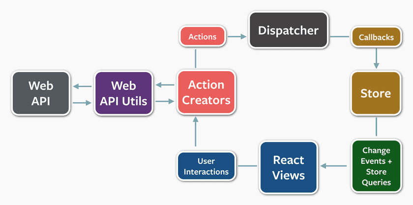

# Week 15 Learning Objectives - Redux, Hooks, and WebSockets

## Redux Learning Objectives

1. Describe the Redux data cycle
- Redux is a node package that facilitates a particular implementation of Flux, which itself is simply a pattern to follow to implement a unidirectional flow of data in our front-end applications. The generic Flux loop can be seen in this diagram:

- The Redux adaptation of Flux can be seen in the following gif:

- If we start at the view, ie what the user sees and interacts with, we can describe the cycle as follows.
- An event is fired, such as a component mounting, or a user clicking on a button.
- There are two major scenarios that result from this event.
  1. If our application knows everything that it needs to reflect the change in our store, we can create an action and dispatch it. An example would be a change to the UI, such as showing a form. We don't need any outside information, we are simply updating our store to indicate that a form should now be displayed.
  2. If our application needs to perform additional outside functions, such as posting or fetching information to/from a database, we dispatch a function, which will be intercepted and invoked before it hits our reducers. The function will ultimately get its data and then dispatch its own action with any additional data that it needed.
- An action is dispatched to the reducers. An action is a POJO that at a minimum has a `type` key, but can also have additional data associated with it that is necessary to invoke a specific desired change in our store.
  - For example, logging out a user may not need any additional information, since we are simply removing information from our store that we already know the location of.
  - Adding a new pokemon in a pokedex application, however, would require us to have the information about the pokemon in the action object so that we can add this data to our store.
- The action is sent to our reducers. The reducers look at the `type` key and see if they need to respond to this particular action. If they do, they return a new object that represents their updated state. It's possible that only one reducer responds to a particular action `type` or that several reducers will need to respond to it, updating their 'slice' of state. This difference does not matter to us because every action will hit every reducer, with reducers that are not impacted by the action simply returning their previous state.
- After the action has hit all of our reducers and our state has been updated, the new state is passed along to each connected component. If the slice of state that that component was concerned with has changed, the props being passed in to the component from mapStateToProps will change. As we know from basic React, a change in props will result in a rerendering of the component, which will ultimately reflect any changes that our initial event triggered.

2. Explain a reducer
- A reducer is a function that is called each time an action is dispatched. The reducer receives an action and the current state as arguments and returns an updated state.
- Redux reducers are required to be pure functions of the dispatched action and the current state. This makes their behavior very predictable and allows their effects to potentially be reversed.
- A typical reducer has a switch statement with a case for each action `type` that will modify its slice of state, as well as a default case. For cases that modify, the reducer returns a new object that reflects the result of the action. For actions that the reducer is not concerned with, the default case simply returns the previous state.
```js
// The `state` parameter is assigned a default value of [] in this case.
// We will often assign a default value of [], {}, or some value such as { currentUser: null } that will be modified by actions dispatched to us.
const fruitReducer = (state = [], action) => {
  switch (action.type) {
    case "ADD_FRUIT":
      return [...state, action.fruit];
    default:
      return state;
  }
};

export default fruitReducer;
```
- We return a new object when an action modifies our slice of state so that `react-redux` knows a change has occurred and can trigger a new mapping of the store's state to props that are concerned with it. If we were to modify the state object itself, it would assume since the new slice of state has the same object id as the old slice of state that no changes have occurred and will not remap and rerender. This ensuring that state is immutable is part of the optimization that makes the diffing algorithms so fast.

3. Configure a React application to use Redux
- There are a couple of different steps that we need to take in order to make sure our React app is able to use Redux.
  1. We need to create a store.
  - We can import the `createStore` function from `redux` and invoke it with arguments for our reducer, an initial state, and any middleware functions that we want to supply.
  - The reducer will be the top-level combined reducer associated with our store (assuming we have multiple composed reducers).
  - The middleware will most likely contain a thunk middleware to intercept functions that are dispatched (such as the one imported from `redux-thunk`), but can also contain other helpful middleware such as loggers that we'll want to easily see our store's state in development (such as the one imported from `redux-logger`)
  ```js
  import { createStore, applyMiddleware, combineReducers, compose } from 'redux';
  import thunk from 'redux-thunk';
  import movies from './movies';
  import auth from './auth';

  const composeEnhancers = window.__REDUX_DEVTOOLS_EXTENSION_COMPOSE__ || compose;

  const reducer = combineReducers({
    movies,
    auth,
  });

  const configureStore = (initialState) => {
    return createStore(
      reducer,
      initialState,
      composeEnhancers(applyMiddleware(thunk)),
    );
  };

  export default configureStore;
  ```
  2. Wrap our application in a `Provider` component, imported from `react-redux`.
  - This component allows us to connect nested components to our store to give them access to the store's state and dispatch function in order to invoke changes.
  - The `Provider` takes a `store` prop, which should be given the store that we created with `createStore`.
  ```js
  import { Provider } from 'react-redux';
  import configureStore from './store/configureStore';

  // configureStore was a function we created that takes in an object to represent the initial state and passes it along to redux's createStore function
  // In this example, we are setting an initial auth slice of state to have a token key pointing to the token we have in local storage. This way our store has access to our current user on first load if there was an auth token stored.
  const token = window.localStorage.getItem('REDUX_LECTURE_AUTH_TOKEN');
  const store = configureStore({ auth: { token } });

  ReactDOM.render(
    <React.StrictMode>
      <Provider store={store}>
        <App />
      </Provider>
    </React.StrictMode>,
    document.getElementById('root')
  );
  ```
  3. Configure any reducers that are being combined for our store.
  - We generally want to compose our reducers so that we have one dedicated to each 'slice' of state. We may for example have a users reducer to track user data (not just our own), a movies reducer for movie data, an auth reducer to track the current user (auth token, details like the logged in user's name), etc.
  - Each reducer will need to take in the previous state as well as the action that is being dispatched
  ```js
  // It's good practice to set up constants for our types. If we use a variable and misspell it, we'll encounter an error. If we use a string in our switch cases, it simply won't match the misspelled string and go to our default case, which is a difficult error to debug.
  const UPDATE_EMAIL_VALUE = 'lecture/auth/UPDATE_EMAIL_VALUE';
  const UPDATE_PASSWORD_VALUE = 'lecture/auth/UPDATE_PASSWORD_VALUE';
  const UPDATE_TOKEN_VALUE = 'lecture/auth/UPDATE_TOKEN_VALUE';

  // Setting up our initial state for when we first create our reducer
  const initialState = {
    token: ""
  };

  function reducer(state = initialState, action) {
    switch (action.type) {
      // Each case that we are concerned with returns a new object with the updated values. We do not modify the original state
      case UPDATE_EMAIL_VALUE: {
        return {
          ...state,
          email: action.value,
        };
      }
      case UPDATE_PASSWORD_VALUE: {
        return {
          ...state,
          password: action.value,
        };
      }
      case UPDATE_TOKEN_VALUE: {
        return {
          ...state,
          token: action.value,
        };
      }
      // If our reducer is not concerned with this particular action, its type will not have matched any of the previous cases. We hit our default case and simply return the previous state, indicating that this slice of state was unaffected by the action.
      default: {
        return state;
      }
    }
  }

  export default reducer;
  ```
  4. Implement any action creators and thunks associated with our slices of state.
  - Action creators are functions that return an action object to be dispatched to our reducers. Actions are POJOs that have a `type` key that our reducers will iterate over to determine if they need to make some kind of change to their slice of state. The action can also have additional keys to provide extra information the reducer may need to make those changes (such as a token that we are trying to store for the current user, or an updated email address for us to change.)
  - Thunks are functions that we are dispatching that are going to be invoked before hitting our reducers. They are typically related to asynchronous calls, such as a request to our backend to get or post data to our database, or a request to a third-party API. After the request is made and our response is received, we are able to invoke our dispatch function again with the necessary information passed to an action creator so that we can hit our reducers and affect a change in our store.
  ```js
  // These are our action creators. They return action objects with at minimum a `type` key, but can also take additional data. In these cases, we're utilizing a `value` key for the updated value of each action (email, password, or token)
  const updateEmailValue = value => ({ type: UPDATE_EMAIL_VALUE, value });
  const updatePasswordValue = value => ({ type: UPDATE_PASSWORD_VALUE, value });
  const updateTokenValue = value => ({ type: UPDATE_TOKEN_VALUE, value });

  // We are exporting these action creators to be used by our connected components
  export const actions = {
    updateEmailValue,
    updatePasswordValue,
    updateTokenValue,
  };

  // This is a thunk that makes an async fetch request to login a user.
  // When we get a response from our backend, we are using the response to dispatch an action creator (updateTokenValue) with the new data we just received. 
  const tryLogin = () => {
    return async (dispatch, getState) => {
      const { auth: { email, password } } = getState();
      const response = await fetch('http://localhost:8000/api/session', {
        method: 'PUT',
        headers: { 'Content-Type': 'application/json' },
        body: JSON.stringify({ email, password }),
      });
      try {
        if (response.status >= 200 && response.status < 400) {
          const data = await response.json();
          dispatch(updateTokenValue(data.token));
          window.localStorage.setItem('REDUX_LECTURE_AUTH_TOKEN', data.token);
        } else {
          console.error('Bad response');
        }
      } catch (e) {
        console.error(e);
      }
    };
  };

  // We export our thunks to be used by our connected components
  export const thunks = {
    tryLogin,
  };
  ```
  5. Connect any components that need access to the store to retrieve data or dispatch actions.
  - We can use the `connect` function imported from `react-redux` in order to connect a React component to our Redux store. `connect` takes in arguments conventionally referred to as `mapStateToProps` and `mapDispatchToProps`.
    - `mapStateToProps` is a function that takes in `state` as an argument and returns an object with keys that we would like to have as props in our connected component. From the `state` argument we can access the store's state and properties that our reducers have set up.
    - `mapDispatchToProps` is a function that takes in `dispatch` as an argument and returns an object with keys that we would like to have as props in our connected component. The `dispatch` argument is our function that we can invoke to send our action object to our reducers.
  - The `connect` function that we invoke with `mapStateToProps` and `mapDispatchToProps` itself returns a function that we invoke (currying!) with the component that we would like to provide these props to. Take a look at the code snippet below for an example:
  ```js
  import React from 'react';
  import { connect } from 'react-redux';
  import { actions, thunks } from './store/auth';

  // The props that we are using update our values are being created in mapDispatchToProps and utilized in our component, in this case as event handlers.
  const LoginForm = props =>
    <>
      <div>
        <input onChange={props.updateEmailValue} type="email" placeholder="Email" required />
      </div>
      <div>
        <input onChange={props.updatePasswordValue} type="password" placeholder="Password" required />
      </div>
      <div>
        <button onClick={props.tryLogin}>Log in</button>
      </div>
    </>
  ;

  // Notice how we are keying into `auth` on our state object. This reflects the auth reducer that was set up at the top level of our application, with email as a key on this slice of state. Nesting reducers nests the values of those reducers under the keys that we specify in combineReducers. Remember that the return values of each of these reducers are POJOs, so nesting reducers just nests these objects.
  const mapStateToProps = state => {
    return {
      email: state.auth.email,
      password: state.auth.password,
    };
  };

  const mapDispatchToProps = dispatch => {
    return {
      updateEmailValue: event => dispatch(actions.updateEmailValue(event.target.value)),
      updatePasswordValue: event => dispatch(actions.updatePasswordValue(event.target.value)),
      tryLogin: () => dispatch(thunks.tryLogin()),
    };
  };

  export default connect(mapStateToProps, mapDispatchToProps)(LoginForm);
  ```

4. Use connected components to access Redux state
- Take a look at the above code block that utilizes the `connect` function.
- The main components in play are `connect` accepting `mapStateToProps` and `mapDispatchToProps` arguments, then being invoked with the component that we would like to connect to the Redux store.
- The keys that are created on the objects that each of these functions return are going to be available on the connected component's props.


5. Use composed reducers to simplify state management
- Composed reducers allow us to separate out our app's concerns into different slices, creating individual reducers for each aspect of data that our store is concerned with.
- We can import the `combineReducers` function from `redux` and invoke it with an object. The keys of the object set up the keys that will be created within our store and the values should point to the reducer that that particular slice of state is associated with. We'll often see them imported as the same name that we want our key to have, so the object can use the JavaScript shorthand of simply putting a reference to the reducer and the key will be made with the same name.
```js
import { combineReducers } from 'redux';
import authentication from './authentication';
import pokemon from './pokemon';

// We are creating keys of authentication and pokemon that point to their respective reducers. These keys will be at the top level of our store's state, so in our mapStateToProps, we would be able to access state.authentication.<<property_defined_in_authentication_reducer>>, for example
const reducer = combineReducers({
  authentication,
  pokemon,
});
```

6. Configure a React application to use the Redux development tools
- We can tell our Redux store to use the devtools compose function by grabbing it from the window with `window.__REDUX_DEVTOOLS_EXTENSION_COMPOSE__`. If the devtools don't exist in the browser (the user hasn't installed them), we can tell Redux to use the standard `compose` function imported from `redux`. We accomplish this by setting up a conditional to default to the compose function if the devtools are not preseent.
- The devtools are allowing us to track the status of our store and how our various actions have impacted it, so adding in this check can be very helpful for us during development.
- In general, this is boilerplate code. The only differences you'll commonly see between projects are the different reducers being used in combineReducers that are specific to your app as well as potentially adding on additional middleware, like a logger function to see the actions being dispatched and their impact on the store in the regular console.
```js
import { createStore, applyMiddleware, combineReducers, compose } from 'redux';
import thunk from 'redux-thunk';
import movies from './movies';
import auth from './auth';

const composeEnhancers = window.__REDUX_DEVTOOLS_EXTENSION_COMPOSE__ || compose;

const reducer = combineReducers({
  movies,
  auth,
});

const configureStore = (initialState) => {
  return createStore(
    reducer,
    initialState,
    composeEnhancers(applyMiddleware(thunk)),
  );
};
```

## React Hooks Learning Objectives

1. Create function components that use state and other React features.
- We can replace the aspects that required us to previously use class components (the use of state and lifecycle methods) with functions imported from the `react` library. This allows us to now use function-based components in every scenario.
- We can replace state by using the `useState` hook. The return value is an array with the a reference to the value being stored as the first element and the function to update the value as the second element.
  - We can also specify an initial value by passing in an argument to `useState`.
```js
// SearchBar.js
const [inputValue, setInputValue] = useState('');
```
  - Wherever we want to reference this value in our component we can use the name we gave to it as the first element.
  - Whenever we want to update the value we can invoke the function we captured as the second element, passing in the new value.
- We can replace lifecycle methods with the `useEffect` hook. `useEffect` takes in a callback function that will be invoked in response to specific events, and an optional array of dependencies as a second argument to define those events:
  - Without specifying a second argument, the function will be invoked after every render.
  - Specifying an array as the second argument will only invoke the function on first mounting and when one of the dependencies listed in the array changes. This means that we can also supply an empty array to ensure the function is only invoked one time, on component mounting.
  - The following effect will be invoked on mount as well as whenever our `context.searchquery` changes.
```js
useEffect(() => {
  const fetchGif = async () => {
    try {
      const res = await fetch(`${apiBaseUrl}&q=${context.searchQuery}`);
      
      if (!res.ok) throw (res);
      const giphyRes = await res.json();
      const gifUrl = giphyRes.data[0].images.fixed_width.url;
      
      setImgUrl(gifUrl);
      setIsLoading(false);
    } catch (err) {
      console.error(err);
    }
  };

  fetchGif();
}, [context.searchQuery]);
```
  - Having the callback function return another function will result in the returned function being run as cleanup when the component unmounts. In this way we can replace our use of the `componentWillUnmount` lifecycle method.

2. Use the `useState` hook to manage a component's state.
- See explanation/code of `useState` below
3. Use the `useState` hook to set a default state, instead of setting the default state in a `constructor()` method.
- See explanation/code of `useState` below
4. Use the `useState` hook to update state, instead of the `setState()` method.
- See explanation/code of `useState` below
```js
import React, { useState, useContext } from 'react';
import { GifContext } from './GifContext';

const SearchBar = () => {
  const context = useContext(GifContext);
  // We are tracking an inputValue with our useState hook.
  // To update this value we can invoke setInputValue with a new value.
  // We are providing a default value of an empty string ''
  const [inputValue, setInputValue] = useState('');

  // We are creating a function to be used as an event handler.
  // When a user types in the input box (onChange event), we invoke this function, capturing the current value of the input field and setting it as the new value of inputValue in our state.
  // We were able to update this value in state using setInputValue because that is what we named the second element in the array returned by useState.
  // This would have previously been implemented with this.setState({ inputValue: e.target.value })
  const updateInputVal = e => {
    setInputValue(e.target.value);
  };

  const searchForGif = e => {
    e.preventDefault();
    context.setSearchQuery(inputValue);
  };

  // Just like how we were setting the value of our inputs to the associated key in state, we are controlling the input here by assing it to our state's value.
  // Instead of this.state.inputValue we are simply referring to the inputValue that we destructured from useState.
  return (
    <form onSubmit={searchForGif}>
      <input
        type="text"
        value={inputValue}
        onChange={updateInputVal}
        placeholder="Search for a GIF!"
      />
    </form>
  );
}

export default SearchBar;
```

5. Use the `useEffect` hook to manage side effect operations (i.e. data fetching).
- Repeated below is the code for a component that performs a fetch for data, in this case a gif url based on a search query.
- The function that we pass in directly to `useEffect` cannot be an `async` function, so we create our async function inside of the callback and immediately invoke it (this could be rewritten as an IIFE)
```js
import React, { useState, useEffect, useContext } from 'react';
import { apiBaseUrl } from './config';
import { GifContext } from './GifContext';

const Gif = () => {
	const context = useContext(GifContext);
	const [ imgUrl, setImgUrl ] = useState();
	const [ isLoading, setIsLoading ] = useState(true);

  useEffect(() => {
    const fetchGif = async () => {
      try {
        const res = await fetch(`${apiBaseUrl}&q=${context.searchQuery}`);
        
        if (!res.ok) throw (res);
        const giphyRes = await res.json();
        const gifUrl = giphyRes.data[0].images.fixed_width.url;
        
        setImgUrl(gifUrl);
        setIsLoading(false);
      } catch (err) {
        console.error(err);
      }
    };

    fetchGif();
  }, [context.searchQuery]);

  if (isLoading) {
		return <h1>Searching for gif...</h1>;
	}

	return (
		<div>
			
			<p>{`It's been ${minutes} "minute${minutes === 1 ? '' : 's'}" since this component mounted.`}</p>
		</div>
	);
};

export default Gif;
```

6. Use the `useEffect` hook in replacement of commonly used component lifecycle methods (`componentDidMount`, `componentDidUpdate`, and `componentWillUnmount`).
- `useEffect` is run when the component is first mounted, replacing `componentDidMount`.
- By specifying what changes we want to respond to in our dependencies array, we can replace our `componentDidUpdate`.
- Returning a function from `useEffect` will invoke the function upon unmounting, replacing our need for `componentWillUnmount`. 

7. Understand how to optimize your application's performance by skipping `useEffect` calls.
- The second argument to `useEffect` is the dependencies array.
- Similar to how we checked to see if certain props or state changed inside of our `componentDidUpdate` method before we invoked any sort of action, the dependencies array checks to see if any of the dependency values have changed and only invokes our `useEffect` hook if a change is detected.
- See previous `useEffect` code blocks for examples.

8. Use the `useContext` hook to access a context object, instead of a `Context.Consumer` or the static `contextType` property.
- `useContext` provides a similar functionality to setting a class component's `contextType`.
- We pass in a reference to the context as an argument to `useContext` and the return value is the object that we can key into for the associated context's value.
- Looking back at the SearchBar component, we use the GifContext's `setSearchQuery` function in order to change the value of the `searchQuery` that context is tracking. This value is ultimately used by our Gif component to search for a matching gif url and display the result in the component.
```js
import React, { useState, useContext } from 'react';
import { GifContext } from './GifContext';

const SearchBar = () => {
  // We pass in a reference to the context that we created and store the return value in a variable
  const context = useContext(GifContext);
  const [inputValue, setInputValue] = useState('');

  const updateInputVal = e => {
    setInputValue(e.target.value);
  };

  const searchForGif = e => {
    e.preventDefault();
    // We are able to access any values that we have on the context within the component.
    // In this case, we are utilizing the setSearchQuery to update the value of searchQuery that context is tracking.
    context.setSearchQuery(inputValue);
  };

  return (
    <form onSubmit={searchForGif}>
      <input
        type="text"
        value={inputValue}
        onChange={updateInputVal}
        placeholder="Search for a GIF!"
      />
    </form>
  );
}

export default SearchBar;
```

## WebSockets Learning Objectives

### Client-Side WebSockets
1. Use the WebSockets API to create a new WebSocket connection to a server
- We can create a new connection to a WebSocket server by creating a new instance of `WebSocket`, passing in a URL that we want to connect to.
```js
const ws = new WebSocket('ws://localhost:8080');
```

2. Create a WebSocket `onopen` event handler function to detect when the connection has been opened
- The `onopen` event handler of our socket can be assigned a callback function that takes in the event as an argument. This can also be written as `addEventListener('open', event => {...})` invoked on our socket.
- Remember that assigning the `on<<eventname>>` like our first example overwrites any other event listeners for that event, so only one handler can exist this way. Using `addEventListener` allows for multiple event handlers to be added to the same event, which can be a useful difference in implementation.
```js
ws.onopen = (e) => {
  console.log(`Connection open: ${e}`);
};
// or
ws.addEventListener('open', e => {
  console.log(`Connection open: ${e}`);
})
```

3. Create a WebSocket `onmessage` event handler function to detect and process messages sent by the server
- We can use the `onmessage` event handler of our socket or add an event listener for the `message` event.
- The captured event will have a `data` key that is the message that was sent from the server. This data is in JSON so it will need to be parsed in order to interact with the object that in represents.
```js
ws.onmessage = (e) => {
  // The event has a data key with the message sent from the server.
  // This is the JSON that needs to be parsed
  const parsedMessage = JSON.parse(e.data)
  // Now that the message has been parsed, it will be in the format of the object the server created.
  // This format will depend entirely on your own implementation, but it can be helpful to have set up a `type` key to indicate what kind of message was being transmitted and how the client should respond to it, as well as a data key that houses the actual content of the message that was transmitted.
  // Similarly to how Redux reducers switch over the action type, if we follow this format we can switch over the message type to determine what we need to do with the content of the message.
  switch (message.type) {
    case 'type-1':
      // do something
      break;
    case 'type-2':
      // do something
      break;
    default:
      throw new Error (`Unknown message type: ${message.type}`);
  }
};

// or

ws.addEventListener('message', e => {
  // message event handler
})
```

4. Create a WebSocket `onerror` event handler function to detect when an error has occurred
- We can use the `onerror` event handler of our socket or add an event listener for the `error` event.
```js
ws.onerror = (e) => {
  console.error(`WebSocket Error: ${e}`);
};
// or
ws.addEventListener('error', e => {
  console.error(`WebSocket Error: ${e}`);
})
```

5. Use the WebSocket `send()` method to send messages to the server
- We can use the `send` method to on the socket to send a message to our server.
- The `send` method takes an string, so if we want to send complex information we can first convert it to JSON.
```js
const message = JSON.stringify({
  type: 'add-new-player',
  data: {
    playerName: 'Bob'
  }
});
ws.send(message);
```

6. Recall that WebSocket message data can be sent as JSON formatted string
- Since `send` requires us to pass a string (or a Blob or ArrayBuffer, but we won't need to get into those at this point), we can convert complex objects into strings using `JSON.stringify(<<object>>)`

7. Recall that WebSocket messages usually have a "type" associated with them so the client can determine how to process them
- Including a `type` makes it easy for the server to know what to do with the message that it receives. I like to think of these `types` as a cross between a Redux action's type and an http server's routes. Our Redux reducers iterate over types to see if the reducer needs to respond to the action. Since we are sending all of our messages to the same location on the backend, sending a message with a different type is similar to sending a regular http request to a different route.
- If we have a `type` of `add-new-player` our server will be able to determine that the data associated with the message should be used to create a new Player instance. If the `type` is `select-game-square`, the server can determine that the data represents a move that the current player is trying to make in our game.

8. Use the WebSocket `close()` method to close the connection to the server
- We can invoke a socket's `close` method to send a `close` event to our server.
- The method does not need to take any arguments since it is simply emitting an event to the server with no data associated with it.
- It is common for us to invoke the close method in our cleanup function for a React component's `useEffect` hook.
```js
const [username, setUsername] = useState('');
const webSocket = useRef(null);

useEffect(() => {
  if (!username) {
    return;
  }

  const ws = new WebSocket('ws://localhost:8080');
  
  // event handlers for onopen, onmessage, onerror, onclose, etc.
  
  webSocket.current = ws;

  // We are using a reference to ws here instead of ws directly
  // In this particular case, we could have used ws instead of the webSocket reference we created since this function closes over the ws variable
  // The reason we are setting up the reference with useRef is so that we can refer to this websocket in other `useEffect` hooks. We are using the reference to be consistent with the syntax used between the different hooks.
  return function cleanup() {
    if (webSocket.current !== null) {
      webSocket.current.close();
    }
  };
}, [username]);
```

9. Create a WebSocket `onclose` event handler function to detect when the connection to the server has been closed
- We can use the `onclose` event handler of our socket or add an event listener for the `close` event.
- The event handler takes in the event as an argument. We generally want to perform cleanup with our component or application state when the socket closes
```js
ws.onclose = (e) => {
  console.log(`Connection closed: ${e}`);
  webSocket.current = null; // Removing the reference to the websocket that no longer exists
  setUsername(''); // Resetting the username that our app's state is tracking
  setMessages([]); // Resetting the messages that our app's state is tracking
};
```

### Server-Side WebSockets
1. Use the `ws` package to create a standalone WebSocket server
- We can use the `ws` package's `Server` function to set up a standalone WebSocket server. We can invoke this function with an object that specifies the port that we would like to run on.
```js
const WebSocket = require('ws');
 
const wss = new WebSocket.Server({ port: 8080 });
```

2. Use the `ws` package to create a WebSocket server that shares a Node.js http server with an Express application
- To share an http server with an express application, instead of passing in the port that we are creating the standalone server on we can pass in a reference to the http server that we have created.
- We can additionally pass in an option that specifies a path that our WebSocket server should respond to instead of a generic root.
- You may see a clientTracking boolean specified to indicate that we want to keep track of each client that has connected to us. The default value is `true`, so it will often be omitted.
```js
const express = require('express');
const https = require('https');
const WebSocket = require('ws');

const app = express();
const server = http.createServer(app);

const wss = new WebSocket.Server({ 
  server,               // mount our WebSocket server on top of our http server
  path: '/ws',          // specifies a root to respond to requests from instead of the default `/`
  clientTracking: true  // keep track of each client in our server's `clients` array (`true` is default)
})
```

3. Create a `connection` event handler listener method to detect when a client has connected to the WebSocket server
- We can listen for the `connection` event on our WebSocket server using the `on` method. The callback to this event captures the socket that connects us to our client.
- The socket that we capture can then listen for events that occur within this connection (such as new messages or the closing of the connection).
```js
wss.on('connection', socket => {
  // code to run after connection
  // potentially add event listeners on `socket` 
  socket.on('message', jsonData => {
    // The client has sent a message to us
    // We can parse the message and then interact with it however we need to on the server
    const parsedData = JSON.parse(jsonData);
    // At this point parsedData will be the object that we went from the client-side, so we can access any keys that we set up there.
    // A common convention is to have a `type` key to tell the server what the data represents, as well as a `data` key for the actual data being transferred
    // In this way, we could have a switch statement to interact with the data based on the `type`, a pattern we've seen previously in our Redux reducers.
  })
})
```

4. Create a `close` event handler listener method to detect when a client has closed the connection to the WebSocket server
- Within our `connection` event handler, in addition to the `message` event, we can also have our socket listen for a `close` event.
- We can perform any kind of cleanup that we need to do when a socket has been closed here (if we are playing a multiplayer game, we could close the socket for the second player if the first one leaves, for example)
```js
wss.on('connection', socket => {
  // ... additional code, such as a `message` event handler
  socket.on('close', event => {
    // perform cleanup tasks, such as closing other sockets, recording a signoff time of a user, etc.
  })
})
```

5. Use the WebSocket `send()` method to send a message to a client
- If we have a reference to an open socket, we can broadcast a message using the `send` method on the socket.
- The `send` method takes in a JSON-formatted message as the first argument and an optional error handler callback as the second argument to be invoked in case sending the message results in an error.
```js
const message = JSON.stringify({
  type: 'update-game',
  data: {
    currentPlayer: {
      playerName: 'Bob'
    },
    squareValues: ['', '', '', '', '', '', '', '', ''],
    winner: null
  }
})

socket.send(message, (err) => {
  if (err) {
    console.error(err);
  }
});
```
- It is also common for us to want to broadcast a message to all clients that we are tracking. We can iterate over our socket's `clients` array and send a message to each one:
```js
wss.clients.forEach(clientSocket => {
  clientSocket.send(message)
})
```
