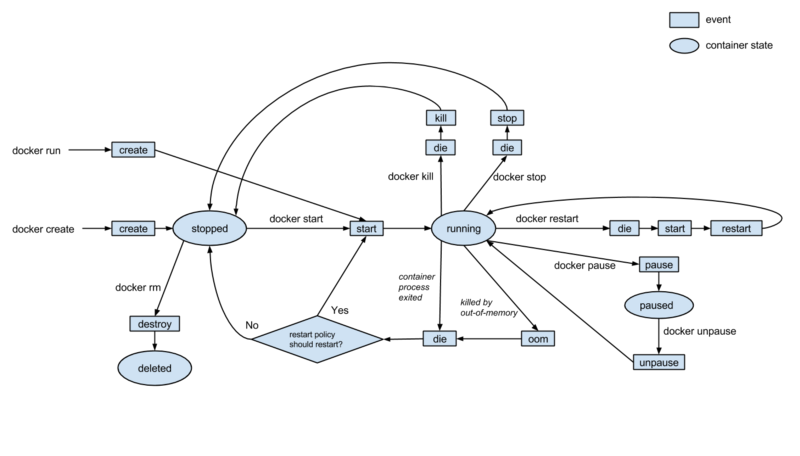

## Alpine Linux and Python Threading (W19D1) - Learning Objectives

### Alpine Linux - Learning Objectives
1. How to install packages using Alpine Package Keeper (apk)
- Make sure you are in your virtual machine (or wherevere alpine is running)
- Determine which package you would like to install
  - pkgs.alpinelinux.org is an online database that is useful in finding these
  - `apk search {package name}` will also search in the command line
  - `apk search cmd:{command name}` will search for a package by the name of the command used in the command line
  - Adding a `-e` flag to these commands indicates an exact search
- `apk add {package name}` will add the specified package (defaults to most recent non-edge, compatible with your architecture)
- `apk upgrade --available` will update available packages 
- `apk del {package name}` will remove a package
  - `-r` is recursive, deleting 
  

2. How to make sure your network is configured properly using the `ifconfig` command
- The `ifconfig` command displays network settings, including your IP address

### Python Threading - Learning Objectives
1. Identify that JavaScript is a single-threaded language
- At no point does more than one block of code have simultaneous access to the memory that you are using.

2. Identify that Python is a pseudo-multi-threaded language
- Multiple sections of code can be run at the same time by different cpus in Python.
- Many of the packages that we use (like Flask) go through great lengths to obscure the multithreading processes that are occurring behind the scenes.
- We can make sure that memory-sensitive code is handled with this possibility in mind through thread synchronization, such as implementing locks (which is what we'll be looking at), barriers, or semaphores.

3. Describe what a lock is for thread synchronization purposes
- A lock is a method of thread synchronization. It creates a mutually exclusive block of code.
- When a lock is created, no other block of code that depends on that lock can be executed until the lock has been released. This helps prevent memory that is critical to the execution of the block to be affected if an interrupt were to occur.


4. Recall what the Global Interpreter Lock (GIL) is in CPython
- CPython is multithreaded, but the GIL only allows one thread of execution at a time.
- Even though there is only one thread of execution at a time, you still have multiple threads accessing the same memory, so many of the same multithreading issues can still arise.


5. Use the `threading.Lock` thread synchronization primitive in Python code
- We can create a `Lock` instance from the `threading` module, which will prevent execution of any other block of code that depends on the lock if another block is already being executed:
```py
from threading import Lock

x = 0
lock = Lock()

def thread_1():
  with lock:
    a = x
    b = a + 1
    # interrupt occurs
    a = a + b
    x = a
    print(x)

def thread_2():
  # cannot execute this block because it depends on the same lock
  # wait until the lock has been cleared
  # thread_1 finishes executing, frees up the lock, then we can continue
  with lock:
    a = x
    a = a + 1
    x = a
    print(x)
```


6. Use `join` to wait on executing threads
- By default, threads that we create with `threading.Thread` are nondaemon threads, meaning they will keep the main thread of execution of our program open until they have finished.
- We can change this behavior by giving the thread instance the `daemon=True` kwarg at instantiation. This means that if our main thread of execution is ready to shut down, it will close out any daemon threads instead of waiting for them to finish.
- If we would like to wait on a daemon thread to finish executing (maybe it was defined somewhere else, like another package, as a background thread but we want to make sure it runs), we can use the `.join()` method on the thread we would like to wait on.
- `.join()` tells the main process to wait on this thread instead of closing it out like it normally would.
```py
import threading
from random import randint
from time import sleep

def func(s):
  print(f"Hello, {s}!")
  sleep_time = randint(0, 3)
  print(f"Sleeping for {sleep_time} seconds")
  sleep(sleep_time)
  print(f"Good-bye, {S}!")

# Create two threads, with the function to execute as the target, specifying they are daemon (background) threads, and providing a tuple of arguments
thread1 = threading.Thread(target=func, daemon=True, args=("Judy",))
thread2 = threading.Thread(target=func, daemon=True, args=("Petra",))

# Start each thread. They will execute simultaneously, alongside our main thread
thread1.start()
thread2.start()

print("All threads started.")
# Join our threads back to our main thread. This isn't the most practical, since we could have just defined them as nondaemon (the default), but if we wanted to conditionally join them on, or join on a thread that we are referencing defined elsewhere, the `join` method allows us to do so.
thread1.join()
thread2.join()
print("Done with this.")
```


## Docker Containers (W19D2) - Learning Objectives
1. Recognize that Docker is an open-source project used to create, deploy, and run application with containers

2. Differentiate between virtual machines and containers
- A virtual machine contains a complete operating system and applications, which is generally more resources than any individual application needs. The kernal takes time to boot up and resources such as RAM and disk space are allocated ahead of time, which will not be released until the VM is taken down.
- Containers do not have a hypervisor, relying instead on the host machine's kernal. They are faster to boot up and more lightweight than a VM.

3. Differentiate between the two main types of hypervisors that enable virtualization: bare metal and hosted
- Bare metal hypervisors have their own device drivers which interact directly with hardware
- Hosted hypervisors act as translators. They are installed on a host OS, then translate commands from the guest operating system into calls that the host OS would make.

4. Recall that containers are used to run processes in isolated environments
- In general we can create a container that has one main task, such as a database or backend server, then connect them together on a network.

5. Summarize that a container is a unit of software that packages code and dependencies so an application can run quickly and reliably between different environments
- A container is an instance of an image. We can think of an image as a template and a container is our instance of that template. (Like a class and instance in OOP)

6. Explain the lifecycle of a docker container
- Containers are ephemeral. We can stop and destroy them very quickly, and when we do, all data created during its existence is wiped out by default.
- We can also very quickly rebuild a container and have it up and running.
- Afer creation, the container is generally started and running until a command is issued to stop, restart, or pause its execution, when it will then enter the appropriate state.
- The diagram below may look intimidating at first, but if we trace it through there are just a few commands that tell the container to enter a new state:


7. Summarize what a Docker image is
- An image is a file that contains the code, system tools, libraries and dependencies that an app needs to run.
- An image can be built off of other images, building up layers with these changes that other images can be built on.
- Each image is read-only. In order to make changes to an existing image we create a new layer with these changes added on top.
- An image is like a template. We cannot execute it directly, but we can create and run a container that is an instance of it.

8. Explain how to start a container and the various flags that we may use with the command
- The command `docker container run {image-name}` will start up a container based on the specified image
- Common flags to include with this command are `-d`, `--net {network name}`, `-p {local port}:{image's port}`, and `--name {container name}`
  - `-d`: run the container in detached mode, running in the background
  - `--net {network name}`: adds the container to the specified network
  - `-p {local port}:{image's port}`: such as `-p 8080:80`, exposes the local port and forwards all traffic to the image's port. This would allow us to navigate to localhost:8080, sending our request to the image's port 80, for example. The port that we want to send traffic to will generally line up with the port indicated in the `EXPOSE` line of the Dockerfile
  - `--name {container name}`: such as `--name web` allows us to name a container. Docker will generate a random name for us, but by specifying, it is easier to determine what a container does and it also allows us to use this name when referencing other containers on our network (through DNS)
- All together an example command may be `docker container run -d --net mybridge -p 8080:80 --name web nginx`

9. Explain what happens when a container is started; what is the process for getting and starting an instance of the image?
- Docker checks to see if the image we are trying to create a container for exists locally.
- If not found locally, it will download the image from the remote repository (defaults to the `latest` version, hosted on Docker Hub)
- A container is created based on the image
- The container is given a virtual IP on the network specified (or default bridge network)
- The port from `-p` is opened and forwarded to the specified internal port of the container (if the flag is given, otherwise no ports are opened)
- The container is started using the `CMD` specified int he Dockerfile

10. Differentiate between how volumes and bind mounts store persistent data for containers.
- Volumes are stored on the host filesystem in a location managed by Docker. They are generally not touched by anything other than Docker.
- The container is given access to the volume and can interact with the data. When the container is removed, the volume persists.
- Bind mounts are not restricted to being managed by Docker. A bind mount can be created anywhere on the host system.
- Since they are not managed by Docker, any other application that has access to its location can interact with the bind mount, such as modifying its contents directly within VSCode or nano.
- Bind mounts can also be a little more difficult to work with since they cannot be included in a Dockerfile, requiring the mount to be specified when a container is run.
- Since a bind mount is pointing to a location on the host directly, it also means that the app running in the container can modify the host system, which may be a security concern.

11. Execute the `docker volume` command to store data and connect to none, one, or multiple containers at once
- To create a volume, we can use `docker volume create {volume-name}` command to create a volume directly
- We can attach a volume to a container using the `-v {volume-name}:{mount-point}:{options}` flag on container run
  - `volume-name`: Optional, can be used to specify a name for the volume instead of creating an id for it. Also used for specifying a volume that already exists.
  - `mount-point`: Required, where the volume will be accessible within the container
  - `options`: Optional, provides additional options, such as read-only (`ro`), etc.
- An example for starting a container with an attached volume:
  - `docker container run -d --name web -v myvol:/app nginx`

12. Implement the default `bridge` driver to define your own bridge network when running multiple containers
- There are many benefits to creating a user-defined bridge network for your containers, including isolation from outside traffic, automatic DNS resolution, and shared environment variables.
- To create a network, we can use `docker network create --driver bridge {network-name}` (bridge is also the default driver)
- To add a container to our custom network, we add the `--net {network-name}` flag to our run command:
```bash
docker network create --driver bridge mybridge
docker container run -d --net mybridge --name db redis
docker container run -d --net mybridge -e DB=db -p 8000:5000 --name web chrch/web
```
- All outside traffic to localhost:8000 will be forwarded to the `web` container's port 5000. Even though the `db` container is not exposed to the outside, the `web` container can still talk to it since it is on the same network.


11. Recognize other Docker network drivers (`overlay`, `host`, `macvlan`, and `none`)
- These drivers are less common, especially for day-to-day interaction, but being familiar with them is good knowledge to have:
  - overlay: Enables Docker Swarm services to communicate with each other
  - host: For standalone containers using Docker Swarm; removes network isolation and uses the host's networking directly
  - macvlan: Allows you to assign a MAC address to a container, making it appear as a physical device on the network
  - none: Disable all networking

12. Execute a health check on a container with the `docker container run ...` command, a Dockerfile, or Docker Compose
- `docker container run ...`
  - When we start up a container, we can specify a health check by using the `--health-cmd="{command-to-run}"` flag.
    - `{command-to-run}` should be a command that could potentially cause an `exit 1` (failure) or returning of `false`. Anything else would be considered a healthy check.
  - Similar to the Dockerfile and compose, we can also specify options with `--health-interval`, `--health-retries`, `--health-timeout`, or `--health-start-period`
  - For example, the following would start a postgres container with a health check to make sure we can communicate with the postgres service:
    - `docker container run --name p2 -d --health-cmd="pg_isready -U postgres || exit 1" postgres`
- Dockerfile
  - In a Dockerfile, we can include the `HEALTHCHECK` instruction which accepts options followed by the command to run:
    - `HEALTHCHECK [OPTIONS] CMD {command}`
    - Possible options are setting an interval (`--interval=DURATION`, default 30s), a timeout (`--timeout=DURATION`, default 30s), a start period (`--start-period=DURATION`, default 0s), and a number of retries (`--retries=N`, default 3)
  - For example, the following would set a timeout of 10s for each attempt at hitting port 3000:
    - `HEALTHCHECK --timeout=10s CMD curl --fail http://localhost:3000/ || exit 1`
- Docker Compose
  - In a compose file, we can indicate a `healthcheck` key, indicating our command as the `test` key
  - We can still indicate our options with an `interval`, `timeout`, `retries`, or `start_period` key
  - For example, the following will start up an nginx container with a healthcheck for curling localhost:
  ```yaml
  version: "3.4" 
  services:
      web:
      image: nginx
      healthcheck:
          test: ["CMD", "curl", "-f", "http://localhost"]
          interval: 1m30s
          timeout: 10s
          retries: 3
          start_period: 1m  # minimum version 3.4 of DockerCompose
  ```

13. Interpret the meaning of the three health statuses: `starting`, `healthy`, and `unhealthy`
- `starting`: The container is currently booting up, health checks have not yet been run (up to a 30 second process)
- `healthy`: Health checks are running at the specified intervals
- `unhealthy`: The number of specified consecutive failures has been reached


14. Execute the `docker container ls` command to view health checks
- The command `docker container ls` shows all of our running containers
- When a healthcheck is associated with a container, the STATUS column of the output will indicate the health check status
```bash
$ docker container ls  
CONTAINER ID        IMAGE               COMMAND                  CREATED             STATUS                   PORTS               NAMES
d68125e29c04        postgres            "docker-entrypoint.s…"   4 minutes ago       Up 4 minutes (healthy)   5432/tcp            p2
```


## Dockerfiles (W19D3) - Learning Objectives
1. Recognize that a Docker image is a template that Docker uses to spawn containers
- We can think of an image as a class that we use to create containers, which are like our instances of the class. We can have multiple instances that are based off the same class, just like we can have multiple containers based off the same image.

2. Execute the inspection of the metadata of an image
- By running `docker image inspect <IMAGENAME>` we can see the metadata associated with an image.
- Some standout info would be:
  - The image's `id`
  - Default environment information]
  - Exposed ports
  - Tags associated with the image
  - The command the image will run by default when a container based on the image is started
  - The hash values for the layers contained within the image (like our history of how we came up with this image)

3. Summarize the meaning of Docker image terminology: image parent, image JSON, union filesystem, image ID, tag, versions, and repository
- `image parent`: the image that this image directly descended from. Since images are layers of changes, any changes we made in our layer are changes that we implented off of this base.
- `image JSON`: basic information about the image such as creation date, author, parent image ID, and execution/runtime configuration like networking and volumes.
- `union filesystem`: combines the series of changes to the files presented in each layer of our image into one cohesive file system.
- `image ID`: a hexadecimal encoding of 256 bits assigned to each layer upon creation, used to globally identify an image.
- `tag`: the descriptive name given to an image ID so that it is human-recognizable. It's the part of the name that comes after the `:` For example, in `node:8.15-alpine`, the `8.15-alpine` is the tag.
- `versions`: When using other images as our bases, specifying an exact version means that updates to an image will not affect our own. We would want to test that these updates do not cause any ill side-effects in our app before manually changing what image we are using.
- `repository`: The part of the name that groups together many tags under a common prefix. It's the part of the name that comes before the `:`. In our example of `node:8.15-alpine`, the `node` is the repository.

4. Execute the viewing of the history of an image's layers
- The command `docker image history <IMAGENAME>` shows the history of an image's layers. There is an entry for each layer, which may not itself be a complete image, just a change from the previous layer (like a new command in a Dockerfile). Those entries will list `<missing>` under the `IMAGE` column, whereas complete images will have the image ID listed.

5. Recall that an intermediate image is created in local image creation to facilitate the use of Docker's build cache
- This is done so that the Docker Engine can efficiently build a new image if changes were to occur somewhere in the middle of the instructions.
- Say our Dockerfile has six steps to it. We build the image and have our final image created locally but also each intermediate step. Now we realize we want to make a change to step #5. Since each intermediary step is cached, the Docker Engine can start at the cached version after step #4 was completed and just implement the new step #5 and then step #6. It didn't have to start the process from scratch because the intermediary steps were cached.
- When our image is pushed to Docker Hub, or some other registry, only the final image is pushed, since we will no longer be making changes to it, just pulling the image and making a container directly or using it as a base.

6. Recall that changes in a container's read/write layer are isolated from the container's other read-only layers
- The read/write top layer of a container gives the appearance that you can modify the image, but the read-only layers below maintain their integrity by isolating any changes in the topmost R/W layer while still displaying a singular file system.
- Any changes that occur to an image are built up on top of it in the R/W layer, so they will never impact any other images that are also based off of that image.

7. Recognize how a Union File System is used to merge files for image layers to present them all as a single read-only directory
- A Union File System merges all the files for each image layer together and presents them as one single read-only directory at the union mount point. This allows the changes that we make to file structures to appear to be impacting files from previous layers, when in reality we are giving Docker instructions for how to modify them in subsequent layers, similar to how git is a series of instructions for changes to make to our files.

8. Execute the `docker build` command to build an image from a Dockerfile while differentiating between the use of `-t` and `-f` flags
- The command `docker build .` will take in the current directory as the context (the `.` in the command) and read in the file called `Dockerfile`, executing the specified commands and building the image.
- If we want to take in a different context, we can change the `.` to another path.
- If we want to use a Dockerfile that is in a different location (but still be able to use this directory as the context) we can use a `-f` flag in order to specify a different filepath. This path points to the location of the Dockerfile, it doesn't change the build context (copying files over from the "current" directory will still reference this one)
- If we want to tag our image that we are building (which is pretty much always a good idea!) we can use the `-t` flag. We generally want to follow the format of `-t <your username>/<app name>:<tag name>`. If we don't give a tag name, it will default to `latest`.
  - An example would be `docker build . -t bamorgan13/eventlight` which would create an image called `bamorgan/eventlight:latest` from my current context.

9. Recall that Docker will re-use the intermediate images (cache), to accelerate the docker build process
- All of our intermediary steps for creating an image locally are cached, so if we were to change our Dockerfile or change what is copied over in a COPY step, etc., all of the steps up to that point that were already cached will be reused so that only the new information will be used to create a new image.

10. Organize how Docker handles logging by using `stdout` and `stderr` to tell Docker where to put those logs
- We can forward the standard output and error locations for our images by telling them to send that data to our log directory managed by Docker.
- In order to do so, we can add a line in to our Dockerfile to set up that forwarding
```
# forward request and error logs to docker log collector
RUN ln -sf /dev/stdout /var/log/IMAGENAME/access.log \
    && ln -sf /dev/stderr /var/log/IMAGENNAME/error.log
```

11. Navigate Docker Hub to implement official, user-made, and open-source container images
- Docker Hub indicates that an image is official with an `OFFICIAL IMAGE` flag in the description and search results. Official images are generally our go-to because they are well maintained, have good documentation, use good practices, and are kept up to date.
- A user-made image is an image pushed up by someone other than an official publisher. They are generally extensions of an official image that adds in some sort of additional functionality. When judging the quality of a user-made image we generally use the same criteria as we do for other packages and libraries: how many downloads does it have, what are the reviews like, when was it last updated, etc.

12. Recall that the `latest` tag is a default tag applied when pulling or pushing an image and that it is usually the most recent and stable version of an image
- If we don't specify a tag, the `latest` tag is used. This applies to both pulling images to build containers from as well as pushing our own images to Docker Hub.

13. Differentiate between the `docker container run <IMAGENAME>` and `docker pull <IMAGENAME>` commands
- The `run` command will take an image, create a container based off of it, and start the container up. If the image does not exist locally, it will pull the image from the registry before creating the container.
- The `pull` command is used to simply pull the image from the registry and add it in to the local cache. No containers are created, we are just getting a local copy of the image.

14. Be able to push a custom image up to Docker Hub
- Similar to being able to push to github or heroku, logging in to docker allows us to push to our Docker Hub account very easily.
- The `docker login` command allows us to enter our Docker Hub credentials to log in. We will stay logged in until we use the `docker logout` command, so you most likely will only have to do this once.
- After we have an image created, we can push it up to Docker Hub with `docker image push <IMAGENAME>`
- If we forgot to tag our image, we can reference the image's id or old name and then retag it with the command `docker image tag <orignalImageIdOrName> <USERNAME>/<IMAGENAME>`
- To build an image based on a Dockerfile, tag it, then push that image up, for example, I could:
```bash
docker build . -t bamorgan13/eventlight
docker image push bamorgan13/eventlight
```


## Docker Compose (W19D4) - Learning Objectives
1. Summarize the most important features of Docker Compose
  - The ability to deploy multiple container easily.
  - Automatic configuration of a single network for your app. Each container for a service joins the created network and is reachable by all the other containers on that network by their service name.
  - Preservation of volume data when containers are created. When docker-compose up runs, if it finds any containers from previous runs, it copies the volumes from the old container to the new container it is creating.
  - Only recreate containers that have changed. Compose caches the configuration used to create a container. When you restart a service and nothing has changed, Compose re-uses the existing containers.
  - Compose allows you to use variables in the Compose file.

2. Define services that make up your app by understanding the general breakdown of a docker-compose.yml file
- The first line of a docker-compose.yml file is the version of Compose you will be using.
- The `services` key starts the containers that we define (the nested keys)
- See below for descriptions of what each key can do for us. The keys with `<>` indicate that those are user-defined names (like `servicename` and `psql` below) whereas the names without `<>` are defined names by Docker Compose that have special meaning and are generally pointing to a value.
- Each key that can accept multiple values (defining `environment` variables, `netoworks`, `ports`, `volumes`, etc.) is written as a new 
- There are a lot of different keys and ways that we can customize our compose file, check out all the different options: https://docs.docker.com/compose/compose-file/ 
```yaml
# If no version is specified, then version 1.0 is assumed. 
# Recommend version 2 at the minimum
version: '3.1'  

services:  # Will start up containers (is the same as using docker container run).
  <servicename>: # Friendly name (postgres, node, etc.), also the DNS name inside your network.
    image: # Image this service will use
    build: # Optional, if we have a Dockerfile and want to build an image locally, specifies where the file is located (generally same location and named `Dockerfile`, so we use `.` as the value that `build` points to.)
    command: # Optional, will replace the default CMD specified by the image
    environment: # Optional, same as -e in docker container run
      <variable-name>: value
      <variable-name>: value
    env_file: # Optional, points to a .env file instead of specifying environment variables directly
      - 'file path'
    networks: # Optional, same as --net in docker container run
      - 'network name'
      - 'network name'
    ports: # Optional, same as -p in docker container run
      - '<host port>:<image port>'
      - '<host port>:<image port>'
    volumes: # Optional, same as -v in docker container run
      - 'volume name'
      - 'volume name'
  <psql>: # servicename2

volumes: # Optional, same as docker volume create
  <volumename>: # Optional, name of the volume to create. Does not point to a value, the key is used as the name. Allows us to use this name in the `volumes` section of a service

networks: # Optional, same as docker network create
  <networkname>: # Optional, name of the network to create. Does not point to a value, the key is used as the name. Allows us to use this name in the `networks` section of a service
```
- Example docker-compose.yaml:
```yaml
# docker-compose.yml
version: "3"
services:
  db:
    image: postgres:11-alpine
    # set up a volume so our database info persists
    volumes:
      - ./tmp/db:/var/lib/postgresql/data
  web:
    # building our own docker image
    build:
      context: .
      dockerfile: Dockerfile
    # name our image
    image: bamorgan13/cha-aux-rails
    volumes:
      - .:/myapp
    ports:
      - "3000:3000"
    depends_on:
      # setting up a dependency on our database container
      - db
    environment:
      DATABASE_URL: postgres://postgres@db
    env_file:
      - .env
```

3. Use the docker-compose --help command to reference Docker Compose CLI flags and commands
- Just like our other command line tools, we can add --help to see the different commands available to us.
- After this basic info, you can also check out more details for that specific command by chaining it on, such as `docker-compose up --help`. The Docker docs are pretty well organized and easy to navigate as well, often having example implementation. Check them out here:
  - https://docs.docker.com/compose/reference/overview/ 
- Here's what the output for `docker-compose --help` looks like for the current version of docker-compose, as an example:
```bash
Define and run multi-container applications with Docker.

Usage:
  docker-compose [-f <arg>...] [options] [COMMAND] [ARGS...]
  docker-compose -h|--help

Options:
  -f, --file FILE             Specify an alternate compose file
                              (default: docker-compose.yml)
  -p, --project-name NAME     Specify an alternate project name
                              (default: directory name)
  --verbose                   Show more output
  --log-level LEVEL           Set log level (DEBUG, INFO, WARNING, ERROR, CRITICAL)
  --no-ansi                   Do not print ANSI control characters
  -v, --version               Print version and exit
  -H, --host HOST             Daemon socket to connect to

  --tls                       Use TLS; implied by --tlsverify
  --tlscacert CA_PATH         Trust certs signed only by this CA
  --tlscert CLIENT_CERT_PATH  Path to TLS certificate file
  --tlskey TLS_KEY_PATH       Path to TLS key file
  --tlsverify                 Use TLS and verify the remote
  --skip-hostname-check       Don't check the daemon's hostname against the
                              name specified in the client certificate
  --project-directory PATH    Specify an alternate working directory
                              (default: the path of the Compose file)
  --compatibility             If set, Compose will attempt to convert keys
                              in v3 files to their non-Swarm equivalent

Commands:
  build              Build or rebuild services
  bundle             Generate a Docker bundle from the Compose file
  config             Validate and view the Compose file
  create             Create services
  down               Stop and remove containers, networks, images, and volumes
  events             Receive real time events from containers
  exec               Execute a command in a running container
  help               Get help on a command
  images             List images
  kill               Kill containers
  logs               View output from containers
  pause              Pause services
  port               Print the public port for a port binding
  ps                 List containers
  pull               Pull service images
  push               Push service images
  restart            Restart services
  rm                 Remove stopped containers
  run                Run a one-off command
  scale              Set number of containers for a service
  start              Start services
  stop               Stop services
  top                Display the running processes
  unpause            Unpause services
  up                 Create and start containers
  version            Show the Docker-Compose version information
```

4. Implement the main docker-compose commands to interact with your containers using simple single line commands
- The basic commands for starting up and taking down your containers are the `up` and `down` commands.
- We can specify that we want to rebuild images when we execute `up` by specifying the `--build` flag instead of using cached images.
- When we take down our containers, our volumes will persist. If we would like to remove our volumes, we can add the `-v` flag when we execute `down`.
- Summary of our docker-compose commands:

| Command	                    | Description                                                                  |
|:--------------------------- |:---------------------------------------------------------------------------- |
| `docker-compose --help`     | List all Docker-Compose commands and options available.                      |
| `docker-compose up`         | Set up your volumes, networks, and start the specified containers.           |
| `docker-compose up --build`	| Build images before setting up volumes and networks to start the containers. |
| `docker-compose down`       |	Stop and remove all containers and networks.                                 |
| `docker-compose down -v`	  | Stop and remove all volumes, containers, and networks.                       |
