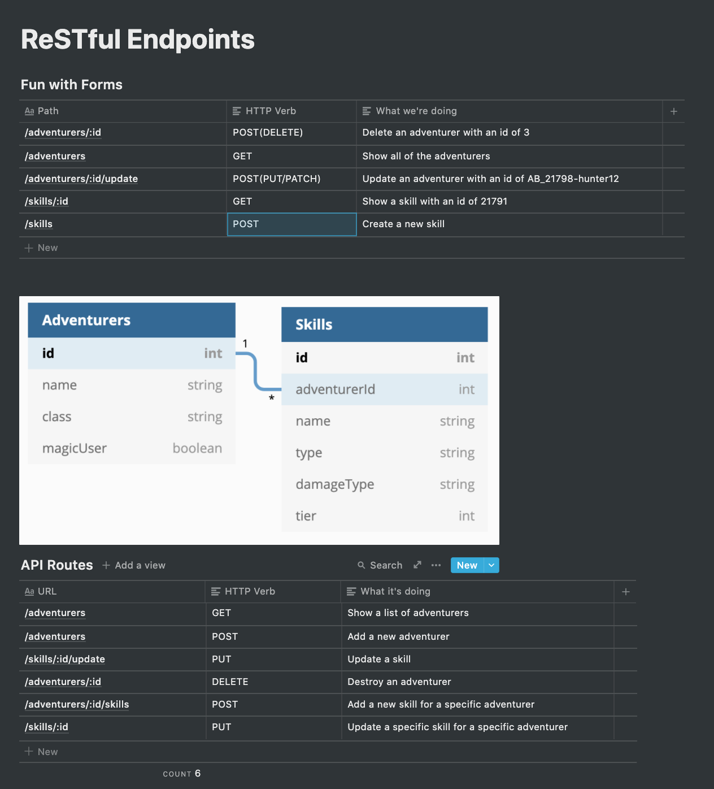

# Lecture Steps

## Part One

Have the students watch the video and ask if there are any questions about it or if there are any questions from the homework they did the previous night.

Then I usually have a Notion page set up with two tables and an image. It may look like this:



The activity for this portion of the lecture is going through the different types of routes that we may want to build and deciding which HTTP verb and path we should use according to RESTful convention.

First we go through how we'd do it with routes they've used before (GET requests through urls in the browser or pretty much anything else through a form).

Next I have them try to answer how we'd do it with api routes, since we get the full list of HTTP verbs and no longer need to append words to our paths to differentiate them (which is what we'd have to do if we were limitted to GET and POST).

## Part Two

We watch the second video and then I answered questions related to that. Afterwards, we jump into adding a DELETE api route to the post index of Breaddit.

* Make sure that breaddit has plenty of posts that you can delete throughout the lecture. You'll want to either continuously drop the database, create the database, remigrate and reseed it, or you'll want to have them start the lecture by seeding a lot more posts into the database.

* Add a delete form to the pug file to show them the old way of doing this. Something similar to this:

```pug
block content
  h1= title
  ul
    each post in posts
      li
        p= post.title
        p= post.body
        form(action=`/posts/${post.id}/delete` method='post')
          input(type="submit", value="Bake it Away")
```

* Create a new route in the posts router that will be hit by this form, and add the logic in there to query for the post via the id in the params and destroy it.

* Go back to the page and show that it works, but that it requires a refresh, so it's not dynamic

* Switch the delete button in the pug file to no longer be a form, but rather just a plain button, and add a class to the ul so that it can be grabbed via the future javascript file. This is also a good time to mention data attributes as a way to store data within the element so that it can be grabbed easily later:

```pug
block content
  h1= title
  ul(class="post-list")
    each post in posts
      li
        p= post.title
        p= post.body
        button(class="delete-button" data-user-id=post.id) Bake it Away
        //- form(action=`/posts/${post.id}/delete` method='post')
        //-   input(type="submit", value="Bake it Away")
```

* Add the line in app.js to tell your app where to look for static assets:
`app.use(express.static(path.join(__dirname, "public")));`

* Create a directory at your root called public, a directory inside of it called javascripts, and a file inside of that called index.js

* In your layout.pug, add `block head` to the head so that we can append lines to it in pug files that extend layout. Then append the index.js file to the head in your index.pug file:

layout.pug:

```pug
html(lang="en")
  head
    block head
      meta(charset="UTF-8")
      meta(http-equiv="X-UA-Compatible", content="IE=edge")
      meta(name="viewport", content="width=device-width, initial-scale=1.0")
      title Document
```

index.pug:

```pug
append head
  script(src="javascripts/index.js" type='module') 
```

* Explain that this allows the js file to run when this file in particular is being rendered, and that since its type is "module", it will only be run once the content is full loaded on the browser

* Jump into the javascript file and query for the ul. Add an event listerner to it for click events. Then do an if statement in there to check if the element that was clicked has the class of "delete-button". If so, you can grab the id of the post via the data attribute that we added to it, and use that in a fetch request to the backend route.

* Create a new api router in the project to house the new api route we'll be building. Usually I just create it an export it so that we can reference it in the app.js file.

* Jump to the app.js file and import the new api router, then app.use it with the other routers. This is a good time to point out that we start the path for api routes with /api and explain why that's beneficial

* Create the new api route in our new router, showing how we know what the path and method will be based off of the fetch request. Throw in the same sort of logic for querying for the Post based on the id and destroying it, then send some sort of response.

* Return to the event listener we set up and set up the logic for if the response is okay. If so, add some logic for removing that post via its container and potentially adding a message that will display once the delete button is hit.
